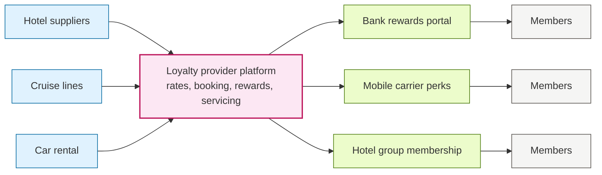
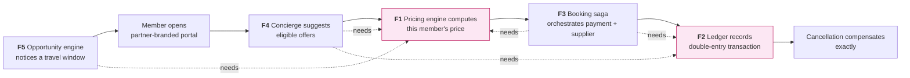

# 01 — Problem Statement & Business Context

| | |
|---|---|
| **Document** | Problem statement |
| **Status** | Approved for design |
| **Audience** | Engineering, product, interview reviewers |
| **Prerequisite reading** | None — start here |

---

## 1. Business context

### 1.1 The white-label travel loyalty model

A **travel loyalty provider** sits between travel suppliers and consumer brands. It does three things:

1. Negotiates private, discounted rates with hotels, cruise lines, airlines, and car rental companies.
2. Operates a booking platform that is re-skinned as *someone else's* brand.
3. Runs a rewards currency that gives members a reason to book there instead of on the open web.

The consumer brand — a bank, a mobile carrier, a hotel group, a professional association — keeps its identity and its customer relationship. The provider is invisible.

### 1.2 How the money works

Revenue comes from four sources, and the first one drives the engineering problem:

| Source | Mechanism |
|---|---|
| **Booking margin** | Buy inventory at a private net rate, sell at a member rate, keep the spread. |
| **Membership fees** | Tiered or subscription-based paid programs. |
| **Platform fees** | Licensing and integration charges to the partner brand. |
| **Managed marketing** | Running campaigns on the partner's behalf. |

The rewards currency — call it **Savings Credits** — is funded out of booking margin rather than purchased by the partner. That is commercially attractive because the partner carries no points liability on its balance sheet, but it means the *provider* carries it, and therefore must account for it precisely.

### 1.3 Closed-user-group pricing

Suppliers will discount deeply, but only if the rate is not publicly visible, because a public discount undercuts their own published pricing and their other distribution channels. The industry term is a **closed user group (CUG)** rate: available only to an identifiable, bounded set of members behind an authenticated barrier.

This is a contractual obligation, not a nice-to-have. A leaked CUG rate can cost the provider the supplier relationship. It makes "who is asking, and are they allowed to see this?" a *first-class architectural concern* rather than an afterthought bolted on at the controller.

---

## 2. The problems this project addresses

### Problem 1 — One rate must become many correct prices

A single supplier net rate of \$100 has to become a different member-facing price in every partner portal, because each partner negotiated a different commercial arrangement:

- Partner A takes a 12% markup; Partner B takes 18%.
- Partner A's top tier gets an extra 3% off; Partner B has no tiers.
- A March campaign gives 5% off beach destinations, but only for Partner B.
- Partner A allows a maximum of 40% of the total to be paid with credits; Partner B allows 100%.
- Partner A excludes one supplier entirely for compliance reasons.

**Why this is hard.** The rules interact, so order matters. They change over time, so yesterday's price must remain reproducible for a dispute. Money must never be computed with floating point. Guardrails must guarantee the platform never sells below cost, no matter how the rules stack. And when a member or an account manager asks "why is this \$1,842?", somebody has to be able to answer precisely.

**What usually goes wrong.** Pricing logic gets scattered across services and stored procedures, no two of which agree. Nobody can explain a price without reading code. A campaign gets misconfigured and the platform silently sells at a loss for a week.

### Problem 2 — A rewards currency is real debt with sloppy bookkeeping

Every credit issued is a promise of future value. That creates obligations that a simple `balance` column cannot honour:

- A booking is paid part in cash and part in credits, so both tenders must succeed or neither may.
- A cancellation must return exactly the credits spent — not a recalculated approximation.
- A member double-clicks "Book", and must not be charged twice.
- Credits expire, and expiry must be reflected the moment it happens, not at next login.
- Finance needs a defensible answer to "what is our outstanding liability per partner today?"

**Why this is hard.** These are the same guarantees a bank ledger needs: atomicity, exactly-once processing, an immutable audit trail, and the ability to ask what a balance *was* at a past moment.

**What usually goes wrong.** Balance is stored as a mutable integer that gets incremented and decremented. A retry double-credits somebody. A partial refund path silently drops credits. Nobody can reconstruct how a balance reached its current value, so every member dispute becomes a manual investigation.

### Problem 3 — A confident AI concierge is a liability

Travel is a natural fit for conversational assistance, and the industry is moving there quickly. But a general-purpose model attached to a booking flow will cheerfully invent a resort, quote a price it made up, and recommend a supplier that this particular partner excludes.

In travel that is not a cosmetic bug. It is a customer who believes they were quoted a price, a support escalation, and potentially a compensation claim.

**Why this is hard.** The assistant must be constrained to a specific member's actual eligible, affordable, bookable inventory — and it must be able to *prove* it was so constrained. It must also respect tenant boundaries absolutely: no prompt should ever coax Partner A's private rates out of Partner B's assistant.

**What usually goes wrong.** A model is handed a broad tool and a hopeful system prompt. It works in the demo and hallucinates in production. There is no audit trail, so nobody can reconstruct why it said what it said.

### Problem 4 — Completing a booking spans systems that fail independently

A single confirmed booking touches a payment processor, a supplier reservation system, an internal ledger, and a booking record. These live behind different network calls with different failure modes. There is no shared transaction across them, and no universal undo.

The failure cases are not exotic; they are Tuesday:

- The card is charged, then the supplier reservation call times out. Did it succeed? Retrying might double-book.
- Credits are burned, then the booking write fails. The member has paid and has nothing.
- The member double-clicks, and two bookings begin racing.
- The price the member accepted twenty minutes ago is no longer the supplier's price.

**Why this is hard.** Each step needs a defined compensating action, and compensations can themselves fail. Retries must be safe, which means every external call needs idempotency. Ambiguous outcomes — a timeout, where success is *unknown* rather than false — must be resolved rather than guessed. And when something does go wrong at 2 a.m., an operator needs to see where a booking stalled and why.

**What usually goes wrong.** The happy path is coded as a straight line with a `try/catch` that logs and moves on. Money and inventory drift apart silently. Nobody notices until finance reconciles at month end, by which time the evidence is gone.

### Problem 5 — Waiting for the member to search wastes the relationship

A loyalty program's advantage over the open web is that it *knows the member* — their travel history, their tier, their credit balance. A booking site that sits passively behind a search box throws that advantage away and competes on price alone, which is precisely the fight a loyalty program should avoid.

The opportunity is to notice things on the member's behalf: a gap in their calendar that is long enough for a trip, a destination they have returned to twice, a price that just dropped on something they viewed.

**Why this is hard.** Doing this well means watching prices continuously without overwhelming supplier systems, deciding when a signal is strong enough to be worth interrupting someone, and — hardest of all — knowing when to stay quiet. An engine that fires too often trains members to ignore it, and that damage is difficult to undo.

**What usually goes wrong.** The trigger logic is a nightly job with a hardcoded threshold. It cannot explain why it fired, has no concept of fatigue, and the marketing team cannot adjust it without a deployment.

---

## 3. Why these five belong together

They are not five separate demos. They are one member journey, and each feature depends on the others being correct:

The dependencies are real, not decorative. The concierge cannot judge affordability without the ledger, or rank by value without the pricing engine. The booking saga needs both, because its compensations must reverse ledger movements against a priced quote. The opportunity engine needs pricing to know whether a drop is actually a drop for *this* member.

Building all five proves the seams hold, which is the genuinely difficult part and the part a disconnected demo always skips.

---

## 4. Goals

| # | Goal | How we know it is met |
|---|---|---|
| G1 | The same inventory prices correctly and differently per partner, tier, and campaign | Two partner portals show different prices for one supplier offer, driven only by configuration |
| G2 | Any price can be explained | An "explain" view lists every rule that fired, in order, with its effect on the running total |
| G3 | Private rates never reach an unauthenticated caller | Integration tests assert anonymous requests receive no net rate and no member price |
| G4 | The credits ledger is provably correct | Ledger balances to zero; a reconciliation job proves ledger totals equal booking totals |
| G5 | Money operations are safe to retry | Replaying any mutation with the same idempotency key produces one effect |
| G6 | Cancellation restores the exact prior state | Property-based test: book then cancel returns the member to their starting balance |
| G7 | The concierge cannot recommend the unbookable | Every recommendation resolves to a real, eligible, affordable, priceable offer |
| G8 | Recommendations are auditable | Each response carries the rules applied and the candidates excluded, with reasons |
| G9 | Tenant isolation holds under adversarial input | Injection-style tests attempting cross-partner data access fail closed |
| G10 | Clean architecture is enforced, not merely claimed | Architecture tests fail the build on any illegal layer dependency |
| G11 | The demo runs with no external dependencies | Clone, run two commands, no API keys, no cloud account |
| G12 | A booking never leaves money and inventory inconsistent | Injected failure at any saga step ends in a consistent state, proven by test |
| G13 | Ambiguous external outcomes are resolved, not guessed | A timed-out supplier call is reconciled to a definite state before the booking settles |
| G14 | An operator can see where a booking stalled | A saga instance view shows each step, its status, attempts, and compensations |
| G15 | Proactive offers are explainable and rate-limited | Every nudge records its trigger signals; fatigue rules cap frequency per member |
| G16 | Business thresholds are configuration, not code | Changing a drift tolerance or nudge threshold requires no deployment |

---

## 5. Non-goals

Stated explicitly so that reviewers do not mistake a deliberate boundary for an oversight.

| Not doing | Why |
|---|---|
| Real supplier integrations | Supplier contracts and credentials are unobtainable for a POC. A simulated supplier with deterministic data demonstrates the same architecture and makes tests repeatable. |
| Flights, cruises, cars, activities | Hotels alone exercise every pricing and ledger path. More verticals add surface area, not insight. |
| Real payment processing | Card handling means PCI scope. A simulated payment service — deliberately **out of process**, with injectable latency and failures — exercises the same distributed control flow without the compliance burden. |
| Production authentication | A seeded member switcher demonstrates tenant and tier behaviour. Real identity is a solved, uninteresting problem here. |
| Horizontal scale, external brokers, distributed caches | SQLite plus a transactional outbox and an in-process dispatcher reproduce the *semantics* of durable messaging — at-least-once delivery, retry, poison handling — without requiring Kafka or RabbitMQ to be installed. Swapping the dispatcher for a real broker is an adapter change, described in [Future improvements](06-future-improvements.md). |
| Fine-tuning or training a model | The value is in grounding and constraint, not in model weights. |
| A polished consumer-grade design system | The frontend demonstrates architecture and the explainability views. It should be clean and credible, not a brand exercise. |

---

## 6. Personas

| Persona | Role | What they need | Feature |
|---|---|---|---|
| **Maya** | Member of a bank's rewards program | To see what she can actually afford with her credits, and to trust the price she was shown | Concierge, pricing, checkout |
| **Devin** | Partner account manager at the provider | To answer "why did my member see this price?" without escalating to engineering | Price explain |
| **Priya** | Finance analyst at the provider | A defensible outstanding-liability figure per partner, at any date | Ledger reporting |
| **Sam** | Supplier relationship manager | Confidence that private rates are not publicly reachable | CUG protection |
| **Alex** | Engineer joining the team | To find where pricing lives on day one and change it without breaking three other things | Clean architecture, architecture tests |
| **Noor** | On-call engineer | To see where a booking stalled, what was retried, and what was compensated — without reading logs line by line | Booking saga, operator view |
| **Theo** | Lifecycle marketing manager | To adjust when members get nudged, and to prove the engine is not spamming them | Opportunity engine, fatigue rules |

---

## 7. Success criteria for the proof of concept

The POC succeeds if a reviewer can, in a ten-minute walkthrough:

1. Open the same offer in two partner brands and see two different, correct prices.
2. Click **Explain** and read the exact rule chain that produced each price, including a discount that the margin floor clamped.
3. Ask the concierge for a recommendation and see the audit block listing what was excluded and why.
4. Pay with a mix of cash and credits, then cancel, and watch the ledger reverse to the exact prior balance.
5. Flip the chaos switch to fail the supplier call mid-booking, then watch the saga compensate and the operator view show exactly where it stopped.
6. Attempt to reach a member price while signed out, and be refused.
7. Trigger the opportunity engine and see a nudge with its trigger signals — then trigger it again and watch the fatigue rule suppress it.
8. Run the test suite and see architecture rules enforced alongside behaviour.

---

## 8. Glossary

| Term | Meaning |
|---|---|
| **Partner / tenant** | The consumer-facing brand whose portal the member uses |
| **Member** | An end customer, always belonging to exactly one partner |
| **Tier** | A membership level within a partner program that can alter pricing |
| **Supplier** | The travel company that ultimately provides the room |
| **Net rate** | What the provider pays the supplier. Never shown to a member. |
| **Member price** | What the member pays, after all partner rules are applied |
| **Margin** | Member price minus net rate. The provider's revenue on the booking. |
| **CUG** | Closed user group — a rate visible only to authenticated members |
| **Savings Credits** | The rewards currency, earnable and spendable against travel |
| **Burn cap** | Maximum share of a booking payable with credits, set per partner |
| **Tender** | A means of payment. A booking may be split across cash and credits. |
| **Liability** | The monetary value of unspent credits the provider owes members |
| **Saga** | A multi-step business process across systems that cannot share a transaction, where each step has a defined compensating action |
| **Compensation** | The action that semantically undoes a completed saga step — a refund rather than a rollback |
| **Outbox** | A table written inside the same transaction as a state change, so an event is never lost when the process dies before publishing |
| **Idempotency key** | A caller-supplied identifier that makes retrying an operation safe by guaranteeing one effect |
| **Rate drift** | The supplier's price changing between the moment a quote was issued and the moment the member pays |
| **Travel window** | A gap in a member's calendar long enough to be a plausible trip |
| **Fatigue cap** | A limit on how often a member may be contacted, regardless of how many signals fire |

---

**Next:** [02 — Requirements & user stories](02-requirements.md)
