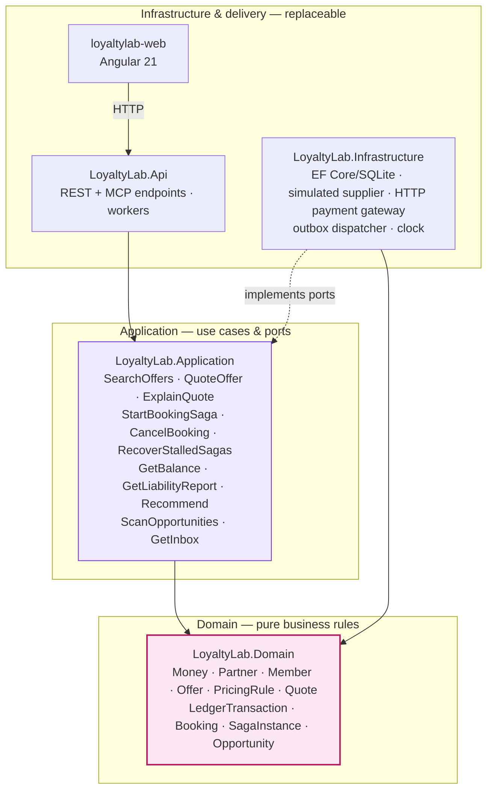
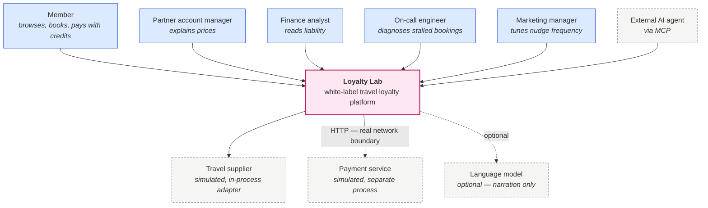
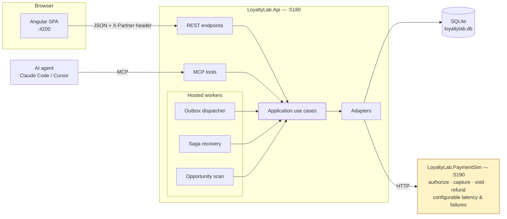
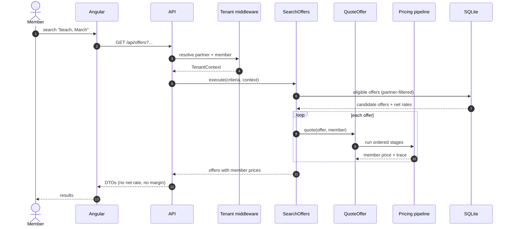
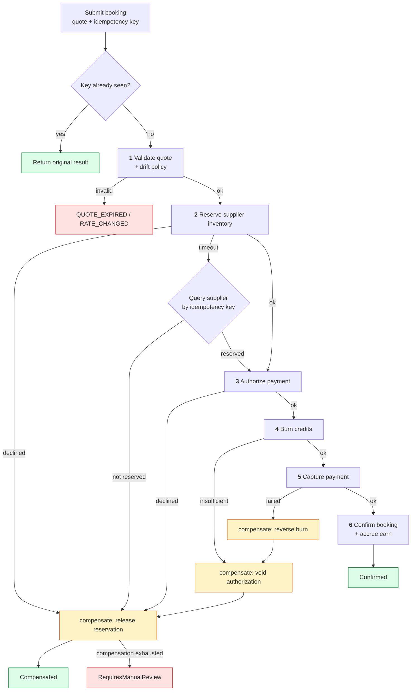
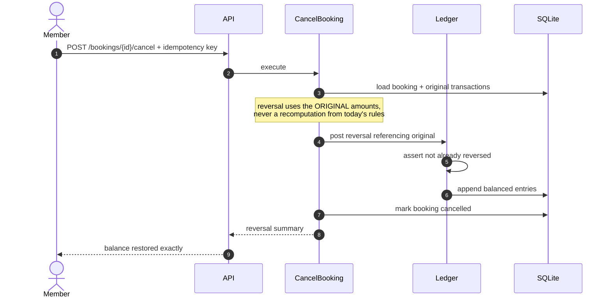
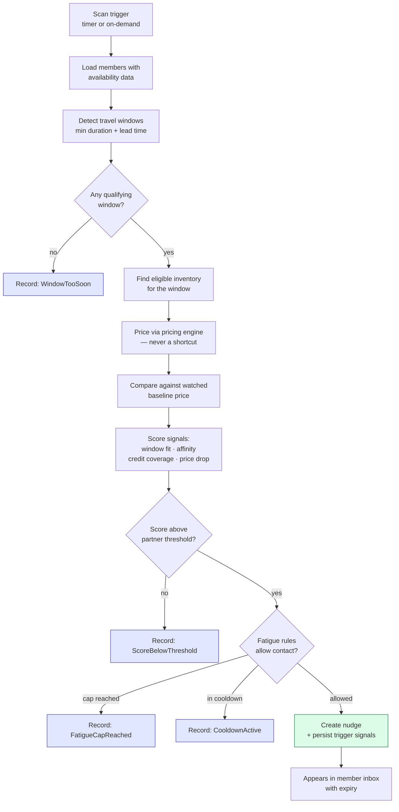
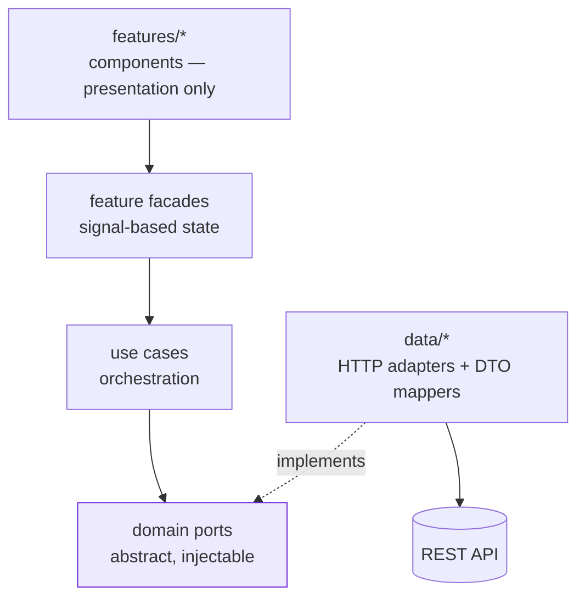
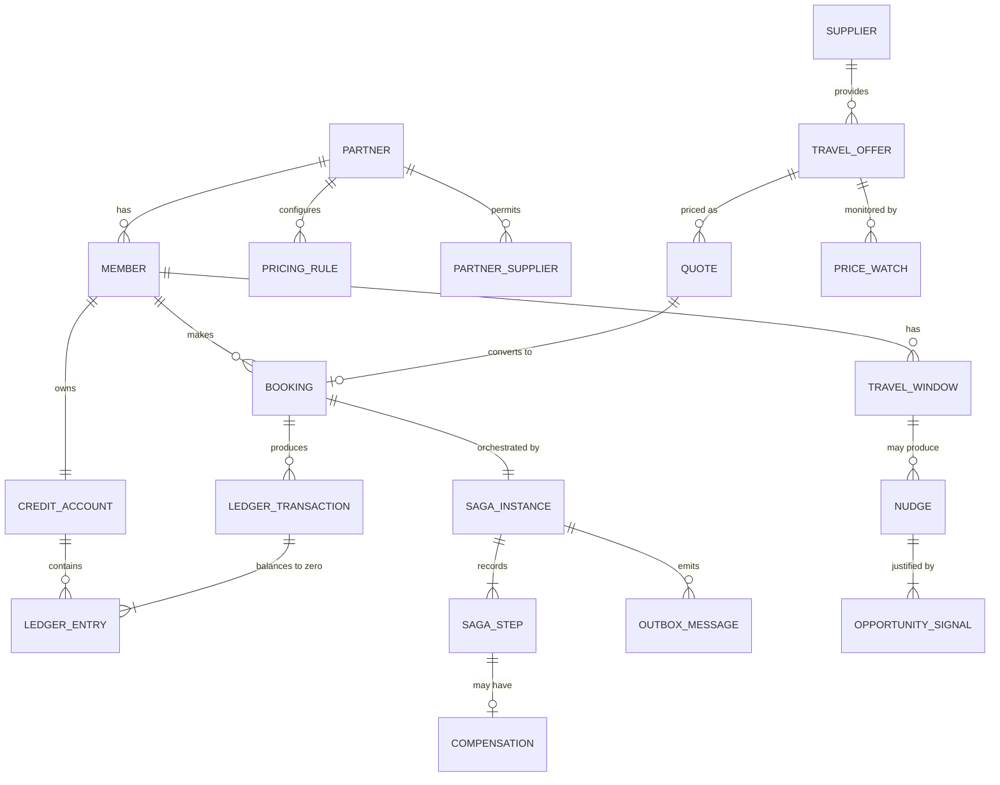

# 03 — High-Level Design

| | |
|---|---|
| **Document** | High-level design (HLD) |
| **Status** | Implemented — aligned with the code in T-082 |
| **Prerequisite reading** | [01 — Problem statement](01-problem-statement.md), [02 — Requirements](02-requirements.md) |

This document covers *shape*: the structure of the solution, how the layers relate, and how the main journeys flow. Concrete types, algorithms, schemas, and endpoint contracts are in the [detailed design](04-detailed-design.md).

---

## 1. Architectural drivers

The design is shaped by six forces, in priority order.

| # | Driver | Consequence |
|---|---|---|
| 1 | **Correctness of money** (FR-X-06, FR-L-02) | Pricing and ledger rules live in a pure domain layer with no I/O, so they are exhaustively testable. Decimal arithmetic and a `Money` value object are mandatory. |
| 2 | **Tenant isolation must be structural** (FR-X-02) | Partner scoping is enforced in one place at the persistence boundary, not repeated in every query where it can be forgotten. |
| 3 | **Consistency must survive partial failure** (FR-B-01, FR-B-05) | Work that crosses a process boundary is orchestrated as a saga with persisted state and explicit compensations, never as a hopeful sequence of calls. |
| 4 | **Everything must be explainable** (FR-P-07, FR-C-05, FR-B-08, FR-O-05) | Prices, recommendations, saga outcomes, and nudges each produce their justification as a *first-class return value*, not a logging side effect. |
| 5 | **Runs anywhere, with nothing** (NFR-08) | SQLite, a sibling payment simulator, an outbox in place of a broker, and a template narrator behind `IOfferNarrator`. No cloud, no keys, no installs. |
| 6 | **Architecture claims must be enforced** (NFR-01) | Layer rules are asserted by a test project that fails the build, not by documentation alone. |

---

## 2. Architectural style

**Clean Architecture** (ports and adapters) with **vertical feature slices** inside each layer.

The two ideas combine rather than compete. Layers answer *"what may depend on what"*; slices answer *"where does this feature live"*. A developer changing pricing touches `Pricing` folders across three projects and nothing else.



**The dependency rule:** arrows point inward, always. `Domain` references no project. `Application` references only `Domain`. `Infrastructure` and `Api` reference inward and are interchangeable. Infrastructure satisfies interfaces *declared by* Application, which is what lets a simulated supplier become a real one without touching a use case.

---

## 3. Solution structure

**One solution. One primary API process. One Angular application. One SQLite database.** The five features are slices within it, not separate deployables — they share a domain and depend on one another (the concierge cannot judge affordability without the ledger; the saga needs pricing and ledger together; the opportunity engine needs pricing to know whether a drop is real).

The one deliberate exception is the **payment simulator**, which runs as a sibling process. That is not incidental: a saga whose "remote" call is an in-process method is theatre. Putting a real network boundary there is what makes timeouts, retries, and genuinely unknown outcomes real rather than simulated ([ADR-0006](adr/)).

```
Arrivia-Loyalty-Lab/
├─ LoyaltyLab.slnx
├─ docs/
├─ scripts/                              run-all.ps1
├─ src/
│  ├─ LoyaltyLab.Domain/                 ← no project references
│  │  ├─ Common/                         Money · Percent · Result · Entity · DomainEvent · IClock
│  │  ├─ Tenancy/                        Partner · Member · MembershipTier · policies
│  │  ├─ Catalog/                        Supplier · TravelOffer
│  │  ├─ Pricing/            [F1] PricingRule · IPricingStage · stages · Quote · PriceTrace
│  │  ├─ Loyalty/            [F2] CreditAccount · LedgerTransaction · LedgerEntry · Liability
│  │  ├─ Booking/            [F3] Booking · TenderSplit · SagaInstance · SagaStep · Compensation
│  │  ├─ Concierge/          [F4] RecommendationCriteria · Candidate · RecommendationAudit
│  │  └─ Opportunity/        [F5] TravelWindow · OpportunitySignal · Nudge · SuppressionReason
│  │
│  ├─ LoyaltyLab.Application/            ← references Domain
│  │  ├─ Abstractions/                   ports: repositories · ISupplierClient · IPaymentGateway
│  │  │                                  IOfferNarrator · IOutbox · IUnitOfWork · IClock
│  │  │                                  ITenantContextAccessor · IIdempotencyStore
│  │  ├─ Catalog/                        SearchOffers
│  │  ├─ Pricing/            [F1] QuoteOffer · ExplainQuote
│  │  ├─ Loyalty/            [F2] GetBalance · GetStatement · GetLiabilityReport
│  │  │                          ExpireCredits · ReconcileLedger
│  │  ├─ Booking/            [F3] StartBookingSaga · AdvanceSaga · GetBooking · ListSagas
│  │  │                          RecoverStalledSagas · CancelBooking · GetSagaInstance · RunAdminWorker
│  │  ├─ Concierge/          [F4] Recommend · NullOfferNarrator
│  │  └─ Opportunity/        [F5] DetectTravelWindows · EvaluateOpportunities · ScanOpportunities
│  │                             GetInbox · ActionNudge · DismissNudge
│  │
│  ├─ LoyaltyLab.Infrastructure/         ← references Application + Domain
│  │  ├─ Persistence/                    DbContext · configurations · migrations · seeding · repositories
│  │  ├─ Persistence/Outbox/             outbox table, dispatcher, poison handling
│  │  ├─ Suppliers/                      SimulatedSupplierClient (deterministic + fault hooks)
│  │  ├─ Payments/                       HttpPaymentGateway → talks to PaymentSim over HTTP
│  │  ├─ Tenancy/                        MutableTenantContextAccessor
│  │  └─ Time/                           SystemClock · FixedDemoClock
│  │
│  ├─ LoyaltyLab.Api/                    ← composition root
│  │  ├─ Endpoints/                      catalog · pricing · booking · loyalty · concierge
│  │  │                                  opportunity · operator · admin
│  │  ├─ Http/                           problem details · MCP use-case forwarding
│  │  ├─ Mcp/                            ConciergeTools — thin adapters over the same use cases
│  │  ├─ Workers/                        OutboxDispatcher · SagaRecovery · OpportunityScan
│  │  ├─ FaultInjection/                 demo chaos switch (Development)
│  │  ├─ Middleware/                     tenant resolution · correlation id · problem details
│  │  └─ Program.cs                      DI wiring — the only place adapters are chosen
│  │
│  ├─ LoyaltyLab.PaymentSim/             ← sibling process: authorize/capture/void/refund
│  │                                       configurable latency, decline rates, timeouts
│  │                                       idempotency-key aware, queryable by key
│  │
│  └─ loyaltylab-web/                    Angular 21
│     └─ src/app/
│        ├─ domain/                      models + port tokens — no Angular HTTP
│        ├─ application/                 use cases + signal stores (facades)
│        ├─ data/                        HTTP adapters implementing the ports + DTO mappers
│        ├─ core/                        interceptors · tenant + session · error mapping
│        ├─ features/                    catalog · offer-detail · checkout · wallet
│        │                               concierge · inbox · operator
│        ├─ shared/                      presentational components · pipes
│        └─ layout/                      shell · partner theming
│
└─ tests/
   ├─ LoyaltyLab.Domain.Tests/           pure unit + property-based (ledger invariants)
   ├─ LoyaltyLab.Application.Tests/      use cases against in-memory fakes
   ├─ LoyaltyLab.Api.Tests/              integration via WebApplicationFactory + SQLite
   ├─ LoyaltyLab.Resilience.Tests/       chaos: injected faults, crash/resume, compensation
   └─ LoyaltyLab.Architecture.Tests/     layer rules — fails build on violation
```

### 3.1 Why the MCP server is not a separate application

`LoyaltyLab.Api/Mcp/` hosts MCP tools inside the same process, calling the *same* Application use cases as the REST endpoints.

This is deliberate and is the point of the exercise: if the MCP path had its own service, it would need its own copy of the eligibility, affordability, and tenant rules — and copies drift. Sharing the use case makes it structurally impossible for the agent-facing surface to be more permissive than the web surface. An architecture test asserts that MCP tool classes contain no business logic.

### 3.2 Feature-to-layer map

Each feature is a column, each layer a row. Nothing in a feature column may reach sideways into another feature's internals; features collaborate through the Application layer only.

| Layer | F1 Pricing | F2 Ledger | F3 Booking saga | F4 Concierge | F5 Opportunity |
|---|---|---|---|---|---|
| **Domain** | Rules, stages, quote, trace | Accounts, transactions, invariants | Saga instance, steps, compensations | Criteria, scoring, audit | Windows, signals, nudges, suppression |
| **Application** | `QuoteOffer`, `ExplainQuote` | `GetBalance`, `GetLiabilityReport` | `StartBookingSaga`, `AdvanceSaga` | `Recommend` | `DetectTravelWindows`, `EvaluateOpportunities`, `ScanOpportunities`, `GetInbox` |
| **Infrastructure** | Rule repo, supplier client | Ledger repo, idempotency store | Outbox, payment gateway, retry policies | — (template `NullOfferNarrator` in Application) | Price-watch store |
| **Api** | `/offers`, `/quotes` | `/wallet`, `/reports` | `/bookings`, `/operator/sagas`, workers | `/concierge`, MCP tools | `/inbox`, scan worker |
| **Web** | Catalog, explain panel | Wallet, statement | Checkout, operator view | Concierge panel | Nudge inbox |

Features collaborate only through the Application layer. `Recommend` calls `QuoteOffer` and `GetBalance`; the saga calls the ledger and pricing use cases; the opportunity engine calls pricing. No domain slice reaches sideways into another slice's internals.

---

## 4. System context



All three external systems sit behind ports, and each has a deterministic simulated implementation so the demo is reproducible and the tests are fast.

The payment service is the one that crosses a **real process boundary**. That distinction carries the whole of Feature 3: an in-process fake cannot time out ambiguously, so a saga built against one would never exercise the case that actually matters — the call whose outcome is unknown.

---

## 5. Runtime containers



`scripts/run-all.ps1` starts all three; they can equally be run in three terminals. Migrations and seeding run automatically at API startup.

The three workers are hosted services in the API process rather than separate deployables. Each is also **invocable on demand from an endpoint**, so the demo can trigger a scan or a recovery pass deliberately instead of waiting for a timer — a small affordance that makes the behaviour presentable.

---

## 6. Key flows

### 6.1 Search and price

The important property: pricing happens **per member**, server-side, and the net rate never crosses the process boundary.



Anonymous callers reach the same endpoint but the tenant middleware yields no member, so the response carries availability only — satisfying FR-X-05.

### 6.2 Checkout as a saga

Checkout spans a supplier, an out-of-process payment service, and the local database. No shared transaction is available, so consistency comes from explicit orchestration with compensation (FR-B-01).



Three properties this shape buys, each mapping to a requirement:

- **Every step persists before it calls out** (FR-B-02), so a process killed at any point resumes from the last known state rather than starting over.
- **A timeout is not a failure** (FR-B-04). The saga records the outcome as *unknown* and asks the far side what actually happened before it decides — the branch most implementations skip, and the one that causes double charges in production.
- **Compensations run in reverse completion order** (FR-B-05) and are themselves retried. When they cannot succeed, the saga terminates in `RequiresManualReview` rather than pretending to have recovered.

Ledger writes remain locally transactional, so FR-L-07's atomicity guarantee still holds within the database — the saga handles only what crosses a process boundary.

### 6.3 Cancellation



### 6.4 Grounded recommendation

```mermaid
flowchart LR
    A[Natural language<br/>+ filters] --> B[Parse to structured criteria]
    B --> C[Load partner-eligible<br/>inventory]
    C --> D[Price each candidate<br/>via pricing engine]
    D --> E[Filter by affordability<br/>balance + burn cap]
    E --> F[Rank deterministically]
    F --> G[Build audit block<br/>considered · excluded · reasons]
    G --> H{Narrator<br/>configured?}
    H -->|no| I[Return structured result]:::core
    H -->|yes| J[Model rephrases<br/>the SAME facts]
    J --> K[Validate: no new offers,<br/>no altered prices]
    K --> I

    classDef core fill:#dcfce7,stroke:#15803d
```



Steps B through G are deterministic and fully tested. The model participates only at step J, and step K rejects any narration that introduces an offer or price not present in the structured result — so a misbehaving model degrades the wording, never the facts.

### 6.5 Opportunity detection *(F5)*

The only flow that starts without a member request.



Two design choices carry this feature.

**Suppressions are recorded, not discarded.** Every branch that decides *not* to contact someone writes down why (FR-O-06, requirements §6.2). Being able to demonstrate a deliberate silence — and explain it — says more about engineering judgement than showing a notification does.

**Actioning a nudge re-prices.** The nudge stores the offer and the signals that produced it, never a price to reuse. Clicking through generates a fresh quote via the normal pricing path (FR-O-09), so a stale number can never reach checkout.

---

## 7. Cross-cutting design

| Concern | Approach |
|---|---|
| **Tenancy** | Middleware resolves partner and member into an immutable `TenantContext`, registered per request. EF Core global query filters apply the partner predicate to every tenant-owned entity, so a forgotten `Where` cannot leak data. |
| **Time** | `IClock` is injected everywhere. Nothing calls `DateTime.Now`. The demo uses a fixed clock so effective-dated rules and expiry behave identically on every machine. |
| **Idempotency** | A store keyed by (partner, operation, key) records the outcome of each mutation. Replays return the recorded result. |
| **Errors** | Expected failures — expired quote, insufficient credits, cap exceeded — are returned as `Result` values with machine-readable codes, surfaced as RFC 7807 problem details. Exceptions are reserved for genuine faults. |
| **Money** | A `Money` value object over `decimal` with currency. Arithmetic across mismatched currencies throws. Rounding happens once, at a named stage. |
| **Logging** | Structured, with correlation id, partner, member, and saga instance attached to every business operation. The correlation id propagates through the outbox into asynchronous work, so one identifier traces a booking end to end. |
| **Cross-partner access** | Returns *not found* rather than *forbidden*, so existence is not disclosed. |
| **Durable messaging** | A transactional outbox is written in the same database transaction as the state change it describes. A dispatcher polls, delivers at least once, retries with backoff, and moves exhausted messages to a poison table instead of blocking the queue. |
| **Saga state** | Persisted before every external call, with step status, attempt counts, and compensation outcomes. Recovery is therefore a matter of reading state, not reconstructing intent. |
| **Retries** | Exponential backoff with jitter and a bounded attempt count, applied only to operations proven idempotent. Non-idempotent operations are made idempotent with a key before they are made retryable. |
| **Fault injection** | A single toggle plus per-request headers can force supplier timeouts, payment declines, and crashes between saga steps. Disabled by default and refused outright in a production profile (NFR-14). |
| **Background work** | Hosted services for outbox dispatch, saga recovery, and opportunity scanning. Each is also exposed as an on-demand endpoint so a demo can trigger it rather than wait. |

---

## 8. Frontend architecture

The Angular application mirrors the same dependency rule, so the reasoning transfers.



Rules that make this real rather than decorative:

- Components never inject `HttpClient`. A lint rule and a review checklist enforce it.
- The `domain` folder holds view models and port tokens with no Angular HTTP dependency, so it is unit-testable in isolation.
- DTOs from the API are mapped into domain models at the `data` boundary. A backend field rename touches one mapper.
- Feature state lives in facades exposing signals; components stay declarative.
- Partner theming is applied through CSS custom properties populated from tenant configuration, so a new brand is data.

---

## 9. Data storage

A single SQLite database with logical groupings that follow the feature slices.



Notable choices, expanded in the [detailed design](04-detailed-design.md):

- **Quotes are persisted**, not held in memory. A booking references an immutable priced snapshot, which is what makes historical explanation and exact reversal possible.
- **Ledger entries are append-only.** No update or delete path exists in the repository interface at all.
- **Pricing rules are effective-dated rows**, so yesterday's price is reproducible.
- **Saga state is a first-class table**, not a status column on the booking. Steps, attempts, and compensations are queryable, which is what makes the operator view possible.
- **Nudges keep their signals**, so a nudge sent three weeks ago can still explain itself.
- **Suppressions are persisted alongside nudges**, because "why didn't this fire?" is a real support question.

---

## 10. Technology choices

| Area | Choice | Rationale |
|---|---|---|
| Backend | .NET 10, Minimal APIs | Matches the target environment; low ceremony for a POC |
| Persistence | EF Core + SQLite | Zero-setup, file-based, supports transactions and global query filters |
| Use cases | Plain handler classes over an in-process mediator library | One less dependency; call sites stay explicit and navigable |
| Failure handling | `Result<T>` for expected outcomes | Makes business failures part of the signature rather than control flow |
| Orchestration | Hand-rolled saga over a persisted state machine | A workflow engine would hide the very mechanics the feature exists to demonstrate |
| Messaging | Transactional outbox + polling dispatcher | Broker semantics without a broker installation |
| Resilience | Polly for retry, backoff, and timeout policies | Standard, declarative, and keeps policy out of business code |
| Background work | `IHostedService` workers, each also on-demand | Demoable without waiting on timers |
| Payment | Separate ASP.NET minimal API simulator | A real network boundary is required for the saga to be genuine |
| Frontend | Angular 21 standalone + signals | Matches the target environment; signals suit facade-based state |
| Styling | SCSS with design tokens | Partner theming through CSS custom properties |
| Tests | xUnit, FluentAssertions, property-based tests, NetArchTest | Behaviour *and* structure are verified |
| AI | Provider-agnostic narrator port; template default (`NullOfferNarrator`) | Demo never depends on a key or a network call |

---

## 11. What this design deliberately does not do

Recording the alternatives considered keeps the simplifications honest rather than accidental.

| Not done | Why not, here | Where it would matter |
|---|---|---|
| Microservices | Five co-dependent features split across process boundaries would add failure modes without adding insight. The one boundary that *does* add insight — payment — is real. | Independent scaling or team ownership |
| External message broker | The transactional outbox plus a polling dispatcher reproduces the semantics that matter: atomic write-and-enqueue, at-least-once delivery, retry, poison handling. Substituting Kafka or RabbitMQ is an adapter swap. | Throughput beyond a single node; fan-out to other systems |
| Rate caching layer | The simulated supplier responds instantly, so a cache would sit idle | Real supplier latency, rate limits, and cost per call |
| Event sourcing for the whole domain | The ledger is already append-only where correctness demands it, and saga state is already an event log in practice | Full temporal reconstruction of every aggregate |
| Real identity provider | Seeded member switching demonstrates tier and tenant behaviour identically | Production |
| Real notification delivery | Nudges land in an in-app inbox; email and push add vendors without changing the interesting logic | Production engagement |
| Machine-learned ranking | Deterministic weighted scoring is explainable and testable, which is the point being made | Optimising conversion at scale |

Each has a corresponding entry in [Future improvements](06-future-improvements.md).

---

**Next:** [04 — Detailed design](04-detailed-design.md)
