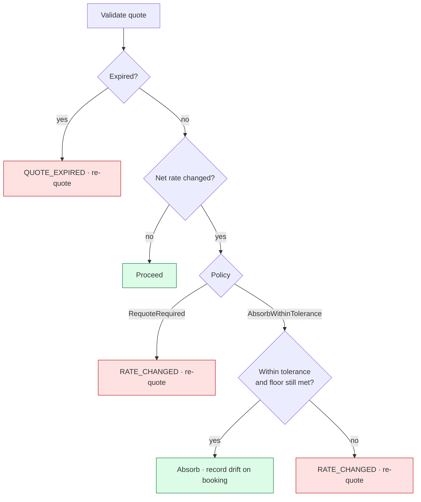
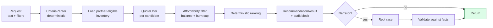

# 04 — Detailed Design (Backend)

| | |
|---|---|
| **Document** | Low-level design — domain, features, application, persistence, API |
| **Status** | Approved for implementation |
| **Prerequisite reading** | [03 — High-level design](03-high-level-design.md) |
| **Companion** | [05 — Frontend design](05-frontend-design.md) |

Code shown here is **specification, not final source**. Signatures are binding; bodies are illustrative. Where a decision had a credible alternative, it is linked to an [ADR](adr/).

**Contents:** [1 Domain](#1-domain-layer) · [2 F1 Pricing](#2-feature-1--pricing-engine) · [3 F2 Ledger](#3-feature-2--savings-credits-ledger) · [4 F3 Booking saga](#4-feature-3--resilient-booking-saga) · [5 F4 Concierge](#5-feature-4--grounded-concierge) · [6 F5 Opportunity](#6-feature-5--opportunity-engine-stretch) · [7 Application](#7-application-layer) · [8 Persistence](#8-persistence) · [9 Errors](#9-error-catalog) · [10 API](#10-api-contracts) · [11 Testing](#11-testing-strategy) · [12 Open questions](#12-open-questions)

---

## 1. Domain layer

`LoyaltyLab.Domain` references no other project. No EF Core, no ASP.NET, no `DateTime.Now`, no `double`.

### 1.1 Common building blocks

#### Money (FR-X-06)

```csharp
public readonly record struct Money : IComparable<Money>
{
    public decimal Amount { get; }
    public Currency Currency { get; }

    public static Money Zero(Currency c);
    public static Money Of(decimal amount, Currency currency);

    public static Money operator +(Money a, Money b);   // throws on currency mismatch
    public static Money operator -(Money a, Money b);
    public static Money operator *(Money a, decimal factor);

    public Money ApplyPercent(Percent p);               // full precision, no rounding
    public Money RoundToCents();                        // MidpointRounding.AwayFromZero
    public bool IsNegative { get; }
}
```

Three rules the type enforces so callers cannot get them wrong:

1. **Arithmetic across currencies throws.** A mismatch is a defect, not a business outcome.
2. **`ApplyPercent` never rounds.** Rounding happens exactly once, at the rounding stage (FR-P-10). Intermediate rounding is how a pipeline silently drifts by cents.
3. **`decimal` throughout.** `double` is banned from the domain and asserted by an architecture test.

`Percent` wraps a decimal with an explicit sign convention: `+12m` is a twelve percent increase, `-3m` a three percent reduction.

#### Result

```csharp
public readonly struct Result<T>
{
    public bool IsSuccess { get; }
    public T Value { get; }              // invalid to read when failed
    public Error Error { get; }

    public static Result<T> Success(T value);
    public static Result<T> Failure(Error error);
    public Result<TNext> Map<TNext>(Func<T, TNext> f);
    public Result<TNext> Bind<TNext>(Func<T, Result<TNext>> f);
}

public sealed record Error(string Code, string Message, IReadOnlyDictionary<string, object?>? Details = null);
```

Expected business failures carry a code from the [error catalog](#9-error-catalog). Exceptions are reserved for defects and infrastructure faults, which keeps failure modes visible in signatures rather than hidden in control flow.

#### Time

```csharp
public interface IClock { DateTimeOffset UtcNow { get; } }
```

Injected everywhere. Effective-dated rules, quote expiry, credit expiry, saga timeouts, and nudge cooldowns all depend on it, so a fixed clock makes tests and demos reproducible (NFR-12).

### 1.2 Tenancy

```csharp
public sealed class Partner : Entity<PartnerId>
{
    public string Code { get; }                          // "SUMMIT", "NIMBUS"
    public string DisplayName { get; }
    public Currency Currency { get; }
    public PartnerTheme Theme { get; }                   // FR-X-04
    public CreditPolicy CreditPolicy { get; }
    public QuotePolicy QuotePolicy { get; }
    public SagaPolicy SagaPolicy { get; }
    public OpportunityPolicy OpportunityPolicy { get; }
}

public sealed record CreditPolicy(
    decimal CreditUnitValue,       // monetary value of one credit, e.g. 0.01
    Percent DefaultBurnCap,        // e.g. 40%
    int CreditLifetimeDays,        // e.g. 730
    Percent EarnRateOnMargin);     // credits issued as a share of booking margin

public sealed record QuotePolicy(
    int ValidityMinutes,           // e.g. 15
    RateDriftPolicy DriftPolicy,   // AbsorbWithinTolerance | RequoteRequired
    Percent DriftTolerance);       // e.g. 2% of net rate

public sealed record SagaPolicy(
    int StepTimeoutSeconds,        // e.g. 10
    int MaxStepAttempts,           // e.g. 3
    int MaxCompensationAttempts,   // e.g. 5
    int StalledAfterSeconds);      // recovery worker threshold, e.g. 60

public sealed record OpportunityPolicy(
    int MinWindowNights,           // e.g. 3
    int MinLeadDays,               // e.g. 14
    decimal ScoreThreshold,        // e.g. 0.55
    Percent PriceDropThreshold,    // e.g. 10%
    int MaxNudgesPerMemberPerWeek, // e.g. 2
    int DismissalCooldownDays,     // e.g. 30
    int NudgeLifetimeDays,         // e.g. 7
    SignalWeights Weights);
```

Every threshold that a business stakeholder might want to change lives in one of these policy records, satisfying FR-X-07 and G16: tuning is configuration, not a deployment.

```csharp
public sealed class Member : Entity<MemberId>
{
    public PartnerId PartnerId { get; }
    public string DisplayName { get; }
    public TierCode Tier { get; }        // Standard | Silver | Gold
    public bool IsActive { get; }
}

public sealed record TenantContext(PartnerId PartnerId, MemberId? MemberId, TierCode? Tier, AccessRole Role);

public enum AccessRole { Anonymous, Member, AccountManager, FinanceAnalyst, Operator }
```

A `Member` belongs to exactly one `Partner`; there is no cross-partner member, which removes an entire class of leakage bug at the model level. `Role` drives explanation visibility (FR-P-08) and access to the operator view.

### 1.3 Catalog

```csharp
public sealed class Supplier : Entity<SupplierId>
{
    public string Code { get; }
    public string Name { get; }
}

public sealed class TravelOffer : Entity<OfferId>
{
    public SupplierId SupplierId { get; }
    public string PropertyName { get; }
    public Destination Destination { get; }
    public Money NetRate { get; }                        // never leaves the server
    public Money TaxesAndFees { get; }
    public IReadOnlySet<OfferTag> Tags { get; }          // Beach, Ski, City, Family, Luxury
    public int StarRating { get; }
    public DateOnly AvailableFrom { get; }
    public DateOnly AvailableTo { get; }
}
```

`NetRate` is domain data but never appears in a member-facing DTO. Enforced at the mapping boundary and asserted against raw JSON in integration tests (FR-X-05, NFR-04), because relying on developers to remember is exactly how rates leak.

### 1.4 Booking and saga types *(F3)*

```csharp
public sealed class Booking : Entity<BookingId>
{
    public PartnerId PartnerId { get; }
    public MemberId MemberId { get; }
    public QuoteId QuoteId { get; }
    public TenderSplit Tender { get; }
    public BookingStatus Status { get; }        // Pending | Confirmed | Cancelled | Failed
    public RateDriftOutcome? Drift { get; }
    public string? SupplierReference { get; }
}

public sealed record TenderSplit(Money CashAmount, int CreditsApplied, Money CreditValue);

public sealed class SagaInstance : Entity<SagaInstanceId>
{
    public PartnerId PartnerId { get; }
    public BookingId BookingId { get; }
    public SagaStatus Status { get; }
    public int CurrentStepIndex { get; }
    public IReadOnlyList<SagaStepRecord> Steps { get; }
    public string CorrelationId { get; }
    public DateTimeOffset StartedAt { get; }
    public DateTimeOffset LastHeartbeatAt { get; }
    public DateTimeOffset? CompletedAt { get; }
    public uint Version { get; }                 // optimistic concurrency
}

public enum SagaStatus { Running, Compensating, Confirmed, Compensated, RequiresManualReview }

public sealed class SagaStepRecord
{
    public SagaStepKind Kind { get; }
    public SagaStepStatus Status { get; }
    public int Attempts { get; }
    public string IdempotencyKey { get; }        // stable per (saga, step)
    public string? ExternalReference { get; }    // supplier or payment id
    public Error? LastError { get; }
    public DateTimeOffset? StartedAt { get; }
    public DateTimeOffset? CompletedAt { get; }
    public CompensationRecord? Compensation { get; }
}

public enum SagaStepStatus { Pending, InProgress, Succeeded, Failed, Unknown, Compensated, CompensationFailed }
public enum SagaStepKind { ValidateQuote, ReserveInventory, AuthorizePayment, BurnCredits, CapturePayment, ConfirmBooking }
```

`Unknown` is a first-class status, not an error variant. That single modelling decision is what makes FR-B-04 expressible: a timed-out call has an *undetermined* outcome, and conflating it with failure is how systems double-charge.

### 1.5 Opportunity types *(F5)*

```csharp
public sealed record TravelWindow(MemberId MemberId, DateOnly Start, DateOnly End)
{
    public int Nights => End.DayNumber - Start.DayNumber;
    public int LeadDays(IClock clock) => Start.DayNumber - DateOnly.FromDateTime(clock.UtcNow.Date).DayNumber;
}

public enum SignalKind { WindowFit, DestinationAffinity, TagAffinity, CreditCoverage, PriceDrop }

public sealed record OpportunitySignal(
    SignalKind Kind,
    decimal RawValue,
    decimal Normalized,     // 0..1
    decimal Weight,
    decimal Contribution);  // Normalized * Weight

public sealed class Nudge : Entity<NudgeId>
{
    public PartnerId PartnerId { get; }
    public MemberId MemberId { get; }
    public OfferId OfferId { get; }
    public DateOnly WindowStart { get; }
    public DateOnly WindowEnd { get; }
    public decimal Score { get; }
    public IReadOnlyList<OpportunitySignal> Signals { get; }
    public NudgeStatus Status { get; }
    public SuppressionReason? SuppressedBecause { get; }
    public DateTimeOffset CreatedAt { get; }
    public DateTimeOffset ExpiresAt { get; }
}

public enum NudgeStatus { Pending, Delivered, Actioned, Dismissed, Expired, Suppressed }

public enum SuppressionReason
{
    FatigueCapReached, CooldownActive, ScoreBelowThreshold,
    NoEligibleInventory, WindowTooSoon, DuplicateOfRecentNudge
}
```

A suppressed nudge is **persisted**, not dropped (requirements §6.2). The engine must be able to answer "why didn't I hear about this?" as readily as "why did I?".

---

## 2. Feature 1 — Pricing engine

### 2.1 Rule model

```csharp
public abstract class PricingRule : Entity<PricingRuleId>
{
    public PartnerId PartnerId { get; }
    public PricingRuleKind Kind { get; }
    public int Priority { get; }                  // higher wins within a kind
    public DateTimeOffset EffectiveFrom { get; }  // inclusive
    public DateTimeOffset? EffectiveTo { get; }   // exclusive, null = open ended
    public RuleScope Scope { get; }               // tier, supplier, tag, destination filters

    public bool AppliesTo(PricingContext context, DateTimeOffset asOf);
    public int Specificity { get; }               // count of populated scope dimensions
}

public enum PricingRuleKind
{
    EligibilityExclusion = 0, BaseMarkup = 1, TierAdjustment = 2,
    CampaignDiscount = 3, MarginFloor = 4, BurnCap = 5
}
```

**Effective dating (FR-P-03).** Rules are rows with validity windows rather than mutable records, so yesterday's price is reproduced by evaluating against `asOf = quote.CreatedAt`.

**Precedence (FR-P-04).** Within a kind, at most one rule applies. Candidates are ordered by a **total** comparator, so a tie is impossible:

| Order | Key | Direction | Rationale |
|---|---|---|---|
| 1 | `Specificity` | descending | A rule scoped to Gold + Beach beats a partner-wide default |
| 2 | `Priority` | descending | Explicit operator override |
| 3 | `EffectiveFrom` | descending | The most recently activated rule wins |
| 4 | `RuleId` | ascending | Final deterministic tiebreak — never reached in practice, but guarantees totality |

`EligibilityExclusion` is the exception: it is a gate, not a selection. *Any* matching exclusion rejects the offer.

### 2.2 The pipeline

```csharp
public interface IPricingStage
{
    PricingStageKind Kind { get; }
    int Order { get; }
    PricingStageResult Execute(PricingState state, PricingContext context);
}

public sealed record PricingState(
    Money RunningTotal, Money NetCost, Money? MaxCreditTender,
    bool IsRejected, Error? RejectionReason);
```

| # | Stage | Behaviour | Requirement |
|---|---|---|---|
| 1 | `EligibilityStage` | Rejects if the partner may not sell this supplier, the tier is not entitled, or the offer is outside its availability window. Short-circuits. | FR-P-02 |
| 2 | `BaseCostStage` | Starting total is `NetRate + TaxesAndFees`; records `NetCost` for the floor stage. | FR-P-01 |
| 3 | `BaseMarkupStage` | Applies the winning partner markup. | FR-P-02 |
| 4 | `TierAdjustmentStage` | Applies the winning tier rule. Absent for partners without tiers. | FR-P-02 |
| 5 | `CampaignDiscountStage` | Applies at most one campaign, chosen by the precedence comparator. | FR-P-02 |
| 6 | `MarginFloorStage` | Clamps upward if the total fell below `NetCost × (1 + floor)`. Records the clamp and its size. | FR-P-05 |
| 7 | `RoundingStage` | The only stage permitted to round. Two decimals, `MidpointRounding.AwayFromZero`. | FR-P-10 |
| 8 | `BurnCapStage` | Computes `MaxCreditTender` from the applicable cap. Does not change the price. | FR-P-02 |

**Why the floor sits at 6.** It must observe the cumulative effect of every discount. Clamping earlier would let a later campaign push the price back under cost — the exact failure the guardrail exists to prevent.

**Why rounding sits at 7.** Rounding before the floor could round *below* the floor by a cent; rounding at each stage compounds error. One rounding, late, is both correct and explainable.

### 2.3 Trace and explanation

```csharp
public sealed record PriceTraceEntry(
    PricingStageKind Stage, int Order,
    string Description,                  // "Base markup +12% (rule SUMMIT-BASE-01)"
    PricingRuleId? AppliedRule,
    Money SubtotalBefore, Money SubtotalAfter,
    bool WasClamped, string? ClampReason);
```

The trace is a return value, not a log (FR-P-07). Serialization is role-aware: because the base-cost stage would reveal the net rate, member roles receive stages 3 onward with amounts relative to a hidden base plus the final price, while internal roles receive the full chain including `NetCost` and computed margin.

### 2.4 Worked examples

The same offer, the same night, two partners — differing only by configuration (G1). **Offer:** net 100.00, taxes 15.00, tags `{Beach}`, supplier `OCEANIC`.

*Partner SUMMIT — Gold member, March campaign active*

| Stage | Effect | Subtotal |
|---|---|---|
| Base cost | 100.00 + 15.00 | 115.00 |
| Base markup | +12% | 128.80 |
| Tier adjustment | Gold −3% | 124.936 |
| Campaign | MARCH-BEACH −5% | 118.6892 |
| Margin floor | floor = net +5% → 120.75 required, clamped | **120.75** |
| Rounding | 2dp | 120.75 |
| Burn cap | 40% | max 48.30 in credits (4 830 credits) |

*Partner NIMBUS — no tiers, no campaign*

| Stage | Effect | Subtotal |
|---|---|---|
| Base cost | 100.00 + 15.00 | 115.00 |
| Base markup | +18% | 135.70 |
| Tier adjustment | no rule | 135.70 |
| Campaign | none active | 135.70 |
| Margin floor | 120.75 required, satisfied | 135.70 |
| Rounding | 2dp | 135.70 |
| Burn cap | 100% | max 135.70 in credits (13 570 credits) |

The SUMMIT clamp is the demo's most instructive moment: a stacked discount would have sold below the commercial minimum, the guardrail caught it, and the explanation says so.

### 2.5 Quote lifecycle

```csharp
public sealed class Quote : Entity<QuoteId>
{
    public PartnerId PartnerId { get; }
    public MemberId MemberId { get; }
    public OfferId OfferId { get; }
    public Money NetCostSnapshot { get; }       // internal only
    public Money MemberPrice { get; }
    public Money MaxCreditTender { get; }
    public IReadOnlyList<PriceTraceEntry> Trace { get; }
    public DateTimeOffset CreatedAt { get; }
    public DateTimeOffset ExpiresAt { get; }

    public bool IsExpired(IClock clock) => clock.UtcNow >= ExpiresAt;
}
```

Quotes are **persisted and immutable** (FR-P-06). A booking references a priced snapshot, which is what makes both historical explanation and exact reversal possible without recomputation.

**Drift handling (FR-P-11)** is evaluated in saga step 1:



---

## 3. Feature 2 — Savings Credits ledger

### 3.1 Account model

Balances are always **derived** (FR-L-04); there is no mutable balance column.

| Account type | Scope | Meaning |
|---|---|---|
| `MemberCredits` | one per member | Outstanding credits owed to that member — the liability |
| `PartnerIssuance` | one per partner | Cumulative source of credits ever issued |
| `PartnerRedemption` | one per partner | Cumulative credits spent on bookings |
| `PartnerBreakage` | one per partner | Cumulative credits lost to expiry |

Sign convention: a positive entry increases that account's balance. Every transaction's entries sum to exactly zero (FR-L-02).

### 3.2 Transaction shapes

```csharp
public sealed class LedgerTransaction : Entity<LedgerTransactionId>
{
    public PartnerId PartnerId { get; }
    public LedgerTransactionType Type { get; }
    public string IdempotencyKey { get; }
    public LedgerTransactionId? ReversesTransactionId { get; }
    public BookingId? BookingId { get; }
    public string Reason { get; }
    public DateTimeOffset OccurredAt { get; }
    public IReadOnlyList<LedgerEntry> Entries { get; }

    // Enforced in the factory — an unbalanced transaction cannot be constructed
    private static void AssertBalanced(IReadOnlyList<LedgerEntry> entries)
        => Guard.Against(entries.Sum(e => e.Amount) != 0, LedgerErrors.Unbalanced);
}
```

| Type | Legs | Net effect |
|---|---|---|
| **Earn** | `MemberCredits +n`, `PartnerIssuance −n` | Member gains, issuance grows |
| **Burn** | `MemberCredits −n`, `PartnerRedemption +n` | Member spends |
| **Expire** | `MemberCredits −n`, `PartnerBreakage +n` | Unused credits lapse |
| **Reversal** | Exact mirror of the referenced transaction | Restores prior state |
| **Adjustment** | `MemberCredits ±n`, `PartnerIssuance ∓n` | Manual correction, always with a reason |

Worked check — earn 500, burn 200, expire 50:

```
MemberCredits(Maya)      +500 −200 −50 = 250   ← balance and liability
PartnerIssuance(SUMMIT)  −500
PartnerRedemption(SUMMIT)      +200
PartnerBreakage(SUMMIT)              +50
                          -----------------
Every transaction sums to zero; issued − burned − expired = 250 ✔
```

That identity is invariant #4 from [requirements §3.2](02-requirements.md#32-invariants), asserted by a property-based test over randomized transaction sequences.

### 3.3 Credits and money

```csharp
public static int ToCredits(Money amount, CreditPolicy policy)
    => (int)Math.Round(amount.Amount / policy.CreditUnitValue, MidpointRounding.AwayFromZero);

public static Money ToMoney(int credits, CreditPolicy policy, Currency currency)
    => Money.Of(credits * policy.CreditUnitValue, currency);
```

With `CreditUnitValue = 0.01`, a 48.30 tender is exactly 4 830 credits. Choosing a unit value that divides the currency's minor unit keeps conversion lossless, which is why the seed data uses 0.01 rather than a fractional cent.

### 3.4 Idempotency (FR-L-05)

```csharp
public interface IIdempotencyStore
{
    Task<IdempotencyRecord?> FindAsync(PartnerId partner, string operation, string key, CancellationToken ct);
    Task<bool> SaveAsync(IdempotencyRecord record, CancellationToken ct);
}
```

Uniqueness is `(PartnerId, Operation, IdempotencyKey)`, backed by a database unique index (the composite primary key) so two concurrent requests cannot both pass a check-then-act race. Callers insert first: `SaveAsync` returns `true` when this request reserved the key, and `false` when the unique index already holds a row — the loser then `FindAsync` and either replays the stored result or returns `IDEMPOTENCY_KEY_REUSED`.

The record also stores a hash of the request payload. A replay with the same key but a different payload is a client defect and returns `IDEMPOTENCY_KEY_REUSED` rather than silently returning an unrelated result.

### 3.5 Expiry, liability, reconciliation

Expiry is an explicit transaction, not a read-time filter (FR-L-09), applied first-in-first-out by a worker that is also invocable on demand. Making it explicit means the statement shows *when* credits lapsed and a past-dated liability report stays stable.

```csharp
public sealed record LiabilityReport(
    PartnerId PartnerId, DateOnly AsOf,
    int CreditsIssued, int CreditsBurned, int CreditsExpired,
    int CreditsOutstanding, Money MonetaryLiability);
```

Reconciliation (FR-L-11) independently sums booking credit tenders and compares against `Burn` less `Reversal`. A mismatch is **reported, never auto-corrected** — silently repairing a discrepancy destroys the evidence needed to find its cause.

---

## 4. Feature 3 — Resilient booking saga

### 4.1 Step contract

```csharp
public interface ISagaStep
{
    SagaStepKind Kind { get; }
    int Order { get; }

    Task<StepOutcome> ExecuteAsync(SagaContext ctx, CancellationToken ct);
    Task<CompensationOutcome> CompensateAsync(SagaContext ctx, CancellationToken ct);

    /// Called when a previous attempt ended Unknown. Queries the far side
    /// using the step's stable idempotency key and reports what actually happened.
    Task<StepOutcome> ResolveUnknownAsync(SagaContext ctx, CancellationToken ct);
}

public sealed record StepOutcome(StepResult Result, string? ExternalReference, Error? Error);
public enum StepResult { Succeeded, Failed, Unknown }
```

Every step supplies all three behaviours. A step that cannot resolve its own ambiguity has no business making a remote call, so `ResolveUnknownAsync` is required rather than optional — the interface makes the obligation impossible to overlook.

Idempotency keys are **derived, not random**: `{sagaId}:{stepKind}`. Deriving them means a retry after a crash reproduces the same key without needing to have persisted it first, which closes the window where a key is generated but lost before use.

### 4.2 Orchestrator

```csharp
public async Task<SagaStatus> AdvanceAsync(SagaInstanceId id, CancellationToken ct)
{
    var saga = await _repo.LoadAsync(id, ct);           // optimistic concurrency via Version

    while (saga.Status == SagaStatus.Running)
    {
        var step = _steps[saga.CurrentStepIndex];

        await _repo.MarkInProgressAsync(saga, step.Kind, ct);   // FR-B-02: persist BEFORE calling out

        var outcome = saga.StepStatus(step.Kind) == SagaStepStatus.Unknown
            ? await step.ResolveUnknownAsync(ctx, ct)           // FR-B-04
            : await step.ExecuteAsync(ctx, ct);

        switch (outcome.Result)
        {
            case StepResult.Succeeded:
                await _repo.MarkSucceededAsync(saga, step.Kind, outcome.ExternalReference, ct);
                saga = saga.Advance();
                break;

            case StepResult.Unknown:
                await _repo.MarkUnknownAsync(saga, step.Kind, outcome.Error, ct);
                return saga.Status;      // recovery worker will resolve; do NOT guess

            case StepResult.Failed when step.Attempts < policy.MaxStepAttempts && IsTransient(outcome.Error):
                await Task.Delay(Backoff(step.Attempts), ct);
                break;                   // retry the same step

            case StepResult.Failed:
                await _repo.MarkFailedAsync(saga, step.Kind, outcome.Error, ct);
                return await CompensateAsync(saga, ct);
        }
    }
    return saga.Status;
}
```

The `Unknown` branch is the one worth reading twice: it returns without deciding. Guessing at that point is what produces double charges, so the saga deliberately parks and lets a resolution pass query the far side.

### 4.3 Compensation

Compensations run in reverse order of completion (FR-B-05):

```csharp
private async Task<SagaStatus> CompensateAsync(SagaInstance saga, CancellationToken ct)
{
    foreach (var step in saga.CompletedSteps.Reverse())
    {
        for (var attempt = 1; attempt <= policy.MaxCompensationAttempts; attempt++)
        {
            var result = await _steps[step.Kind].CompensateAsync(ctx, ct);
            if (result.Succeeded) { await _repo.MarkCompensatedAsync(saga, step.Kind, ct); break; }
            if (attempt == policy.MaxCompensationAttempts)
                return await _repo.MarkRequiresManualReviewAsync(saga, step.Kind, result.Error, ct);
            await Task.Delay(Backoff(attempt), ct);
        }
    }
    return await _repo.MarkCompensatedAsync(saga, ct);
}
```

| Step | Compensation | Notes |
|---|---|---|
| `ValidateQuote` | none | Read-only |
| `ReserveInventory` | Release reservation | Idempotent by supplier reference |
| `AuthorizePayment` | Void authorization | Cheap; no member-visible movement |
| `BurnCredits` | Post `Reversal` transaction | Exact amounts via FR-L-08 |
| `CapturePayment` | Refund | Slow and member-visible — hence captured last |
| `ConfirmBooking` | Mark cancelled, reverse earn | Terminal on success |

Ordering rationale: the reservation is placed before money moves because releasing a hold is cheap and reliable, whereas refunding a captured payment is slow and visible. Separating authorization from capture means a credits failure costs a void rather than a refund.

### 4.4 Transactional outbox (FR-B-06, FR-B-07)

```csharp
public sealed class OutboxMessage
{
    public Guid Id { get; init; }
    public PartnerId PartnerId { get; init; }
    public string Type { get; init; }
    public string Payload { get; init; }          // JSON
    public string CorrelationId { get; init; }
    public DateTimeOffset OccurredAt { get; init; }
    public DateTimeOffset? DispatchedAt { get; set; }
    public int Attempts { get; set; }
    public string? LastError { get; set; }
}
```

The message is inserted in the **same database transaction** as the state change it describes, so the two cannot diverge. A hosted dispatcher then polls in `OccurredAt` order, delivers, and marks dispatched. Delivery is at-least-once, so every handler must be idempotent — an explicit constraint, documented at the handler interface.

After `MaxAttempts` a message moves to a poison table rather than blocking the queue behind it, and appears in the operator view.

### 4.5 Recovery worker (FR-B-11)

Finds sagas whose `Status` is `Running` or `Compensating` and whose `LastHeartbeatAt` is older than `StalledAfterSeconds`, then resumes each one. Because state is persisted before every call and keys are derived, resumption cannot duplicate an external effect.

This is also how the crash test works: kill the process mid-saga, restart, assert the saga reaches a terminal state with exactly one payment authorization at the simulator (NFR-13).

### 4.6 Concurrency (FR-B-12)

Three mechanisms, layered:

1. A **unique index** on `SagaInstance.BookingId` — one saga per booking.
2. **Optimistic concurrency** on `SagaInstance.Version` — a losing writer retries against fresh state.
3. The **idempotency store** on the entry point — a double submission returns the first result rather than starting a second saga.

### 4.7 Fault injection (FR-B-09, NFR-14)

```csharp
public sealed record FaultProfile(
    bool SupplierTimeout = false, bool SupplierDecline = false,
    bool PaymentTimeout = false, bool PaymentDecline = false,
    SagaStepKind? CrashAfterStep = null,
    int? AddedLatencyMs = null);
```

Supplied per request via an `X-Fault-Profile` header, or globally by configuration. `CrashAfterStep` throws a non-catchable marker exception that the host treats as a process abort, which is what makes the recovery path demonstrable rather than merely unit-tested.

Registration is guarded: the fault injector is only added to the container when `Features:FaultInjection` is enabled, and the API refuses to start if that flag is set in a production environment.

### 4.8 Operator view (FR-B-08)

`GET /api/operator/sagas/{id}` returns the instance, every step with status, attempts, timings, external references, errors, and compensation outcomes — plus any poisoned outbox messages for the correlation id. This is the artifact behind US-12, and it is a first-class endpoint rather than a log query.

### 4.9 Payment simulator process (ADR-0006)

`LoyaltyLab.PaymentSim` is a separate host on port **5190**. It shares no project references with the platform; a shared type would let the saga know things a real processor would not. State is in-memory.

| Method | Route | Notes |
|---|---|---|
| `POST` | `/payments/authorizations` | Requires `Idempotency-Key`. Same key and payload replay the original hold. `402` on decline. |
| `POST` | `/payments/authorizations/{id}/capture` | Full capture. Requires `Idempotency-Key`. |
| `POST` | `/payments/authorizations/{id}/void` | Authorized holds only. Requires `Idempotency-Key`. |
| `POST` | `/payments/authorizations/{id}/refund` | Captured payments only. Requires `Idempotency-Key`. |
| `GET` | `/payments/by-key?key=` | Resolves `Unknown` after a client timeout. |
| `GET` | `/payments` | Simulator inventory for chaos tests. |
| `GET` | `/health` | Liveness. |

`Simulator:LatencyMs`, `DeclineRate`, `TimeoutRate`, and `TimeoutHangMs` control faults. A timeout hang is a delay **after** the authorization is stored, so a client that gives up can still query a real hold.

### 4.10 Simulated supplier (in-process)

The supplier stays in-process (`SimulatedSupplierClient`) — it is not the process boundary ADR-0006 reserved for payment. `ReservationRequest` is `(OfferId, DateOnly StayDate, string IdempotencyKey)`. Fault hooks (`TimeoutOnReserve`, `DeclineOnReserve`, `AddedLatencyMs`) are set in tests today; T-038 will drive them from `X-Fault-Profile`.

`TimeoutOnReserve` stores the hold first, then returns `StepResult.Unknown` with no reference. `QueryReservationAsync` is what resolves that ambiguity (FR-B-04). A real hang is impossible in-process; the store-then-unknown order is the analogue of PaymentSim's hang-after-commit.

---

## 5. Feature 4 — Grounded concierge

### 5.1 Deterministic core



Criteria parsing is rule-based: keyword and synonym matching against destinations and tags, plus date and budget extraction. Unrecognised input yields an unconstrained search rather than an error, and the audit records which terms were understood. Deliberately unglamorous — it keeps the demo deterministic, and a model can be substituted later behind the same interface.

Ranking is a documented weighted score, never a model output:

```csharp
public sealed record RankingWeights(
    decimal ValueForMoney  = 0.40m,
    decimal CreditCoverage = 0.25m,
    decimal TagMatch       = 0.20m,
    decimal StarRating     = 0.15m);
```

### 5.2 Audit block (FR-C-05)

```csharp
public sealed record RecommendationAudit(
    int CandidatesConsidered, int CandidatesReturned,
    IReadOnlyList<ExclusionRecord> Exclusions,
    IReadOnlyList<string> InterpretedTerms,
    RankingWeights Weights, bool NarrationApplied);

public enum ExclusionReason
{
    SupplierNotPermitted, TierNotEntitled, OutsideAvailability,
    UnaffordableWithCredits, BudgetExceeded, DestinationMismatch
}
```

### 5.3 The narrator boundary (FR-C-06, FR-C-07)

```csharp
public interface IOfferNarrator
{
    Task<Result<string>> NarrateAsync(RecommendationResult facts, CancellationToken ct);
}
```

`NullOfferNarrator` is the default and returns a templated sentence, so the application is fully functional with no key and no network (NFR-08). `LlmOfferNarrator` is opt-in.

The narrator receives only the already-computed result and cannot query anything. Its output passes a validator that rejects narration containing a currency amount not present in the facts, or a property name not in the returned set; on rejection the system falls back to the template and records `NarrationApplied = false`. A misbehaving model degrades prose, never facts.

### 5.4 MCP tools (FR-C-08)

| Tool | Delegates to | Returns |
|---|---|---|
| `get_travel_recommendations` | `Recommend` | Ranked offers with prices and the audit block |
| `explain_offer_price` | `ExplainQuote` | Role-filtered price trace |
| `get_credit_balance` | `GetBalance` | Balance, burn cap, monetary equivalent |

Tenant context arrives as a required tool argument, validated identically to the HTTP path. An architecture test asserts that no type under `Api/Mcp` references `Domain` directly or contains conditional business logic.

---

## 6. Feature 5 — Opportunity engine *(stretch)*

### 6.1 Detection

Availability is a seeded per-member feed of busy periods; windows are the gaps between them.

```csharp
public IReadOnlyList<TravelWindow> Detect(Member member, IReadOnlyList<BusyPeriod> busy, OpportunityPolicy policy)
    => Gaps(busy)
        .Where(w => w.Nights >= policy.MinWindowNights)
        .Where(w => w.LeadDays(_clock) >= policy.MinLeadDays)
        .ToList();
```

### 6.2 Scoring (FR-O-04)

Each signal normalizes to `0..1`, is weighted, and contributes to a total. Every component is persisted with the nudge so the score can be re-derived later.

| Signal | Raw measure | Normalization |
|---|---|---|
| `WindowFit` | Nights available vs. typical stay length for the destination | Ratio clamped to 1 |
| `DestinationAffinity` | Prior bookings to that destination | Saturating at three visits |
| `TagAffinity` | Overlap between offer tags and the member's historical tag mix | Jaccard similarity |
| `CreditCoverage` | Share of member price payable with credits | Direct proportion, capped by burn cap |
| `PriceDrop` | Decrease against the watched baseline | Percentage over threshold, capped at 30% |

```csharp
score = signals.Sum(s => s.Normalized * s.Weight);   // weights sum to 1.0
```

Pricing goes through the normal engine (FR-O-02) — no shortcut estimate — because a nudge quoting a price the checkout would not honour is worse than no nudge at all.

### 6.3 Fatigue rules (FR-O-06)

Evaluated in order; the first match suppresses and records its reason:

1. `CooldownActive` — the member dismissed a similar nudge inside `DismissalCooldownDays`.
2. `FatigueCapReached` — delivered nudges in the trailing week reach `MaxNudgesPerMemberPerWeek`.
3. `DuplicateOfRecentNudge` — same offer and overlapping window already sent.
4. `ScoreBelowThreshold` — total score under `ScoreThreshold`.

Suppressed nudges are persisted with `Status = Suppressed` (§1.5), which is what allows US-14's "prove you are not spamming them".

### 6.4 Price watching (FR-O-03, FR-O-11)

A `PriceWatch` row stores the baseline net rate and last-checked timestamp per offer. The scan worker refreshes in bounded batches ordered by staleness, so supplier call volume stays proportional to batch size rather than to membership. Baselines update on a rolling basis, so a permanently cheap offer stops registering as a drop.

### 6.5 Actioning (FR-O-09)

A nudge stores the offer and its signals, never a reusable price. Actioning calls `QuoteOffer` through the normal path, so the member always sees a live quote and a stale number can never reach checkout.

---

## 7. Application layer

### 7.1 Use case shape

```csharp
public interface IUseCase<TRequest, TResponse>
{
    Task<Result<TResponse>> ExecuteAsync(TRequest request, CancellationToken ct);
}
```

Plain classes registered in DI, no mediator library ([ADR-0003](adr/)). Dependencies arrive as constructor ports, so tests substitute fakes with no container.

| Use case | Slice | Requirements |
|---|---|---|
| `SearchOffers` | Catalog | FR-X-05, FR-P-01 |
| `QuoteOffer` / `ExplainQuote` | F1 | FR-P-01 … FR-P-08 |
| `SimulateRuleChange` *(COULD)* | F1 | FR-P-12 |
| `GetBalance` / `GetStatement` | F2 | FR-L-04, FR-L-12 |
| `EarnCredits` / `BurnCredits` / `AdjustCredits` / `ReverseLedger` | F2 | FR-L-03, FR-L-05, FR-L-06, FR-L-08 |
| `GetLiabilityReport` / `ReconcileLedger` | F2 | FR-L-10, FR-L-11 |
| `ExpireCredits` / `ExpireDueCredits` | F2 | FR-L-09 |
| `StartBookingSaga` / `AdvanceSaga` / `CompensateSaga` | F3 | FR-B-01 … FR-B-07 |
| `RecoverStalledSagas` / `GetSagaInstance` | F3 | FR-B-08, FR-B-11 |
| `CancelBooking` | F3 | FR-L-08 |
| `Recommend` | F4 | FR-C-01 … FR-C-07 |
| `DetectTravelWindows` / `EvaluateOpportunities` | F5 | FR-O-01 … FR-O-06 |
| `ActionNudge` / `DismissNudge` | F5 | FR-O-09, FR-O-10 |

### 7.2 Ports

```csharp
public interface IPartnerRepository      { }
public interface IOfferRepository        { }
public interface IPricingRuleRepository  { }
public interface ILedgerRepository       { /* append + read only — no update, no delete */ }
public interface IQuoteRepository        { }
public interface IBookingRepository      { }
public interface ISagaRepository         { }
public interface INudgeRepository        { }
public interface ISupplierClient         { Task<Result<Money>> GetCurrentNetRateAsync(OfferId id, CancellationToken ct);
                                           Task<StepOutcome> ReserveAsync(ReservationRequest r, CancellationToken ct);
                                           Task<StepOutcome> ReleaseAsync(string reference, CancellationToken ct);
                                           Task<StepOutcome> QueryReservationAsync(string idempotencyKey, CancellationToken ct); }
public interface IPaymentGateway         { Task<StepOutcome> AuthorizeAsync(PaymentAuthorizeRequest r, CancellationToken ct);
                                           Task<StepOutcome> CaptureAsync(PaymentReferenceRequest r, CancellationToken ct);
                                           Task<StepOutcome> VoidAsync(PaymentReferenceRequest r, CancellationToken ct);
                                           Task<StepOutcome> RefundAsync(PaymentReferenceRequest r, CancellationToken ct);
                                           Task<StepOutcome> QueryByKeyAsync(string idempotencyKey, CancellationToken ct); }
public interface IOutbox                 { void Enqueue(OutboxMessage message); }
public interface IOfferNarrator          { }
public interface IUnitOfWork             { }
public interface ITenantContextAccessor  { TenantContext Current { get; } }
public interface IIdempotencyStore       { }
```

`ILedgerRepository` exposes no update or delete method at all — append-only is expressed in the type system rather than trusted to discipline (FR-L-01). Both external clients expose a `QueryBy…` method, because FR-B-04 is unimplementable without one.

---

## 8. Persistence

### 8.1 Schema

| Table | Notes |
|---|---|
| `Partners` | Serialized `CreditPolicy`, `QuotePolicy`, `SagaPolicy`, `OpportunityPolicy`, `PartnerTheme` |
| `MembershipTiers` · `Members` | Members indexed on `(PartnerId, Id)` |
| `Suppliers` · `PartnerSuppliers` | Absence of a join row means not permitted |
| `TravelOffers` | Indexed on `(SupplierId, AvailableFrom, AvailableTo)` |
| `PricingRules` | Table-per-hierarchy; indexed on `(PartnerId, Kind, EffectiveFrom, EffectiveTo)` |
| `Quotes` | Trace as JSON; indexed on `(PartnerId, MemberId, ExpiresAt)` |
| `Bookings` | References `QuoteId`; tender split and drift outcome |
| `SagaInstances` | Unique index on `BookingId`; `Version` for optimistic concurrency; indexed on `(Status, LastHeartbeatAt)` for recovery scans |
| `SagaSteps` | Child of instance; unique on `(SagaInstanceId, Kind)` |
| `OutboxMessages` | Indexed on `(DispatchedAt, OccurredAt)` |
| `PoisonMessages` | Exhausted outbox messages |
| `LedgerAccounts` · `LedgerTransactions` · `LedgerEntries` | Transactions unique on `(PartnerId, IdempotencyKey)`; entries indexed on `(AccountId, OccurredAt)` |
| `IdempotencyRecords` | Unique on `(PartnerId, Operation, Key)` |
| `BusyPeriods` · `PriceWatches` · `Nudges` · `NudgeSignals` | F5; nudges indexed on `(PartnerId, MemberId, CreatedAt)` |

### 8.2 Tenant isolation (FR-X-02)

```csharp
modelBuilder.Entity<Member>().HasQueryFilter(m => m.PartnerId == _tenant.Current.PartnerId);
```

A forgotten `Where` cannot leak data because the predicate is applied by the provider. Two safeguards back it up: an integration test requesting a Partner B identifier under Partner A context and expecting *not found*, and an architecture test asserting every `ITenantOwned` entity has a filter configured.

### 8.3 Seed data

| Entity | Seeded |
|---|---|
| Partners | `SUMMIT` (tiered, 12% markup, 40% burn cap, campaigns, absorb-drift) · `NIMBUS` (flat 18%, no tiers, 100% cap, requote-on-drift) |
| Tiers | SUMMIT: Standard, Silver, Gold |
| Suppliers | `OCEANIC`, `ALPINE`, `METRO` — NIMBUS may not sell `OCEANIC`, demonstrating exclusion |
| Offers | 24 across three destinations and five tags, spanning availability windows |
| Members | Maya (SUMMIT, Gold, 6 000 credits) · Ravi (SUMMIT, Standard, 500 credits) · Chen (NIMBUS, 12 000 credits) |
| Rules | Base markups, Gold −3%, `MARCH-BEACH` −5% (SUMMIT only), margin floor +5%, burn caps |
| Ledger | Opening `Earn` transactions establishing those balances |
| F5 data | Busy periods leaving Maya a qualifying window; price-watch baselines set above current rates so a drop is detectable |

Maya and Ravi differ only by tier, isolating the tier effect. Chen sits on a different partner with the same underlying offers, isolating the partner effect. The two partners also differ in drift policy, so US-10 can be demonstrated both ways.

---

## 9. Error catalog

RFC 7807 problem details with the code in an `errorCode` extension member, so the frontend switches on a stable string rather than parsing prose.

| Code | HTTP | Meaning |
|---|---|---|
| `PARTNER_NOT_RESOLVED` | 400 | No partner context on the request |
| `OFFER_NOT_FOUND` | 404 | Unknown, or belongs to another partner |
| `OFFER_NOT_ELIGIBLE` | 422 | Excluded by partner or tier rules |
| `QUOTE_NOT_FOUND` | 404 | Unknown, or belongs to another member |
| `QUOTE_EXPIRED` | 409 | Past `ExpiresAt`; re-quote required |
| `RATE_CHANGED` | 409 | Supplier rate moved beyond tolerance |
| `BURN_CAP_EXCEEDED` | 422 | Credit tender above the partner cap |
| `INSUFFICIENT_CREDITS` | 422 | Credit tender above available balance |
| `MEMBER_NOT_FOUND` | 404 | Unknown, or belongs to another partner |
| `LEDGER_TRANSACTION_NOT_FOUND` | 404 | Unknown, or belongs to another partner |
| `TRANSACTION_ALREADY_REVERSED` | 409 | The referenced ledger transaction was already reversed |
| `ROLE_NOT_PERMITTED` | 403 | Caller role cannot perform this operation |
| `PAYMENT_DECLINED` | 402 | Authorization or capture refused |
| `PAYMENT_NOT_FOUND` | 404 | Unknown payment, or the hold never landed |
| `SUPPLIER_UNAVAILABLE` | 503 | Reservation could not be placed |
| `BOOKING_IN_PROGRESS` | 409 | A saga is already running for this booking |
| `SAGA_REQUIRES_REVIEW` | 409 | Terminal state needing manual intervention |
| `IDEMPOTENCY_KEY_REUSED` | 409 | Same key, different payload |
| `BOOKING_ALREADY_CANCELLED` | 409 | Cancellation replay with a different key |
| `NUDGE_EXPIRED` | 410 | Actioned after its lifetime |
| `LEDGER_UNBALANCED` | 500 | Invariant breach — a defect, never expected |

Cross-tenant access deliberately returns `*_NOT_FOUND` rather than a forbidden status, so existence is not disclosed (US-07).

---

## 10. API contracts

Base path `/api`. Partner context in `X-Partner-Code`; member identity in `X-Member-Id` for the demo; internal demo roles in `X-Access-Role` (`FinanceAnalyst`, `AccountManager`, `Operator`). [ADR-0005](adr/0005-header-based-demo-identity.md) records headers as a deliberate stand-in for real authentication.

| Method | Route | Use case |
|---|---|---|
| `GET` | `/offers` | `SearchOffers` |
| `POST` | `/offers/{id}/quote` | `QuoteOffer` |
| `GET` | `/quotes/{id}/explain` | `ExplainQuote` |
| `POST` | `/bookings` | `StartBookingSaga` — requires `Idempotency-Key` |
| `GET` | `/bookings/{id}` | Booking with saga summary |
| `POST` | `/bookings/{id}/cancel` | `CancelBooking` — requires `Idempotency-Key` |
| `GET` | `/wallet/balance` · `/wallet/statement` | `GetBalance` · `GetStatement` |
| `GET` | `/reports/liability?asOf=` | Finance role only |
| `GET` | `/operator/sagas` · `/operator/sagas/{id}` | Operator role only |
| `POST` | `/operator/sagas/{id}/retry` *(COULD)* | FR-B-13 |
| `POST` | `/concierge/recommend` | `Recommend` |
| `GET` | `/inbox` · `POST` `/inbox/{id}/action` · `/inbox/{id}/dismiss` | F5 |
| `POST` | `/admin/run/{worker}` | Trigger outbox, recovery, expiry, or opportunity scan on demand |
| `GET` | `/partners/current/theme` | Frontend theming |

**Quote response**

```jsonc
{
  "quoteId": "q_01J...",
  "offerId": "o_01J...",
  "memberPrice":     { "amount": 120.75, "currency": "USD" },
  "maxCreditTender": { "amount":  48.30, "currency": "USD" },
  "maxCredits": 4830,
  "expiresAt": "2026-08-23T18:15:00Z"
  // no netRate, no margin — absent entirely for member roles
}
```

**Booking response** — note the saga is visible from the start, not just on failure:

```jsonc
{
  "bookingId": "b_01J...",
  "status": "Confirmed",
  "tender": { "cash": { "amount": 72.45, "currency": "USD" }, "credits": 4830 },
  "drift": { "applied": "Absorbed", "netRateDelta": { "amount": 1.20, "currency": "USD" } },
  "saga": {
    "id": "s_01J...", "status": "Confirmed",
    "steps": [
      { "kind": "ValidateQuote",    "status": "Succeeded", "attempts": 1 },
      { "kind": "ReserveInventory", "status": "Succeeded", "attempts": 2, "externalReference": "OCE-88213" },
      { "kind": "AuthorizePayment", "status": "Succeeded", "attempts": 1 },
      { "kind": "BurnCredits",      "status": "Succeeded", "attempts": 1 },
      { "kind": "CapturePayment",   "status": "Succeeded", "attempts": 1 },
      { "kind": "ConfirmBooking",   "status": "Succeeded", "attempts": 1 }
    ]
  }
}
```

**Concierge response** (abridged)

```jsonc
{
  "narrative": "Three beach stays fit your dates, and credits cover most of the first.",
  "narrationApplied": false,
  "recommendations": [
    { "offerId": "o_01J...", "propertyName": "Coral Bay Resort", "quoteId": "q_01J...",
      "memberPrice": { "amount": 120.75, "currency": "USD" }, "creditsCover": 4830, "score": 0.82,
      "reasons": ["Strong value for money", "Credits cover 40%", "Matches: beach"] }
  ],
  "audit": {
    "candidatesConsidered": 24, "candidatesReturned": 3,
    "interpretedTerms": ["beach", "March"],
    "exclusions": [
      { "offerId": "o_01J...", "reason": "SupplierNotPermitted", "detail": "OCEANIC not permitted for NIMBUS" },
      { "offerId": "o_01J...", "reason": "UnaffordableWithCredits", "detail": "Requires 8 200 credits, available 6 000" }
    ],
    "weights": { "valueForMoney": 0.40, "creditCoverage": 0.25, "tagMatch": 0.20, "starRating": 0.15 }
  }
}
```

---

## 11. Testing strategy

| Project | Scope | Representative assertions |
|---|---|---|
| `Domain.Tests` | Pure logic, no I/O | Stage ordering; floor clamps a stacked discount; rounding applied once; `Money` rejects currency mismatch; **property-based**: random transaction sequences preserve all five ledger invariants; signal weights sum to one |
| `Application.Tests` | Use cases with fakes | Expired quote rejected; burn cap enforced; idempotent replay produces one effect; cancellation restores the exact balance; fatigue rules suppress with the correct reason |
| `Api.Tests` | Integration via `WebApplicationFactory` + SQLite | Anonymous response contains no `netRate`, **asserted on raw JSON**; Partner B identifier under Partner A context returns 404; prompt injection returns no foreign data; MCP tool and REST endpoint agree for identical inputs |
| `Resilience.Tests` | Chaos against a real `PaymentSim` | Payment decline releases the reservation; capture failure reverses the burn; killing the host mid-saga leaves exactly one authorization at the simulator after recovery; a timeout resolves via query rather than a guess; exhausted compensation lands in `RequiresManualReview` |
| `Architecture.Tests` | Structure | Domain references nothing; no `double` in Domain; no `DateTime.Now` anywhere; every `ITenantOwned` entity has a query filter; MCP adapters hold no business logic; `ILedgerRepository` exposes no mutating method beyond append |

Two of these deserve emphasis. Asserting on **raw JSON** rather than a mapped DTO is what actually verifies NFR-04 — a serializer change could start emitting the net rate while every DTO test still passes. And `Resilience.Tests` runs against the **real payment simulator process**, because a saga tested only against an in-memory fake never encounters the ambiguous timeout that motivates the whole design.

---

## 12. Open questions

| # | Question | Resolution |
|---|---|---|
| 1 | Earn on booking or on completed stay? | Booking, for demo immediacy. Real programs accrue on stay — noted in [future improvements](06-future-improvements.md). |
| 2 | Partial cancellation? | Out of scope; full cancellation only. |
| 3 | Campaign stacking? | One campaign per quote, chosen by precedence. |
| 4 | Currency conversion? | Single currency per partner; both seeded partners use USD. |
| 5 | Should the outbox drive the saga itself? | No. The saga is driven synchronously with a recovery fallback; using the outbox as the driver would make every step asynchronous and obscure the orchestration being demonstrated. |
| 6 | Real calendar integration for F5? | No. A seeded availability feed behind the same port; a real integration changes the adapter only. |

---

**Next:** [05 — Frontend design](05-frontend-design.md)
