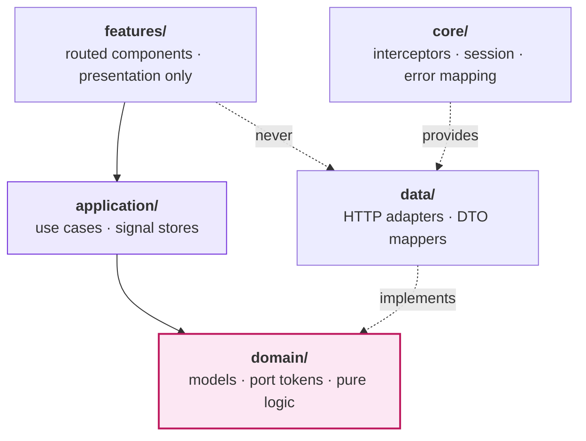

# 05 — Detailed Design (Frontend)

| | |
|---|---|
| **Document** | Low-level design — Angular application |
| **Status** | Approved for implementation |
| **Prerequisite reading** | [03 — High-level design](03-high-level-design.md), [04 — Backend detailed design](04-detailed-design.md) |

Angular 21, standalone components, signals, SCSS with design tokens. Code is **specification, not final source**.

The same dependency rule that governs the backend governs the frontend (NFR-09). A clean backend behind a component that calls `HttpClient` inline is not a clean application; it is a clean backend with a mess in front of it.

**Contents:** [1 Layers](#1-layers) · [2 Domain](#2-domain-layer) · [3 Application](#3-application-layer) · [4 Data](#4-data-layer) · [5 Core](#5-core-layer) · [6 Screens](#6-feature-screens) · [7 Theming](#7-partner-theming) · [8 Errors](#8-error-handling) · [9 Accessibility](#9-accessibility) · [10 Testing](#10-testing-strategy) · [11 Performance](#11-performance)

---

## 1. Layers



| Layer | May import | Must not import |
|---|---|---|
| `domain/` | nothing but TypeScript | Angular, RxJS, HttpClient |
| `application/` | `domain/` | `data/`, `features/`, HttpClient |
| `data/` | `domain/` | `application/`, `features/` |
| `features/` | `application/`, `domain/`, `shared/` | `data/`, HttpClient |
| `core/` | all, for wiring only | — |

**A component never injects `HttpClient`.** It injects a store; the store calls a use case; the use case depends on a port; the port is implemented in `data/` and bound once in `core/`. Swapping REST for GraphQL, or the live API for an in-memory fake in tests, touches one provider registration.

This is enforced, not merely intended, by an ESLint boundary rule mirroring the backend's architecture tests:

```jsonc
// eslint.config.js — no-restricted-imports, abridged
{ "target": "src/app/features/**", "disallow": ["**/data/**", "@angular/common/http"] },
{ "target": "src/app/application/**", "disallow": ["**/data/**", "**/features/**"] },
{ "target": "src/app/domain/**", "disallow": ["@angular/**", "rxjs"] }
```

---

## 2. Domain layer

Plain TypeScript: models, discriminated unions, and injection tokens describing what the application needs. No decorators, no framework.

```ts
export interface Money { readonly amount: number; readonly currency: string; }

export interface OfferSummary {
  readonly offerId: string;
  readonly propertyName: string;
  readonly destination: string;
  readonly starRating: number;
  readonly tags: readonly OfferTag[];
  readonly memberPrice: Money | null;   // null when signed out — the type says so
}
```

`memberPrice: Money | null` encodes FR-X-05 in the type system. A component cannot forget to handle the signed-out case, because the compiler will not let it.

```ts
export interface PriceTraceEntry {
  readonly stage: PricingStageKind;
  readonly description: string;
  readonly subtotalBefore: Money;
  readonly subtotalAfter: Money;
  readonly wasClamped: boolean;
  readonly clampReason: string | null;
}

export type SagaStepStatus =
  | 'Pending' | 'InProgress' | 'Succeeded' | 'Failed'
  | 'Unknown' | 'Compensated' | 'CompensationFailed';

export interface SagaStepView {
  readonly kind: SagaStepKind;
  readonly status: SagaStepStatus;
  readonly attempts: number;
  readonly externalReference: string | null;
  readonly error: string | null;
}

export interface NudgeView {
  readonly nudgeId: string;
  readonly propertyName: string;
  readonly windowStart: string;
  readonly windowEnd: string;
  readonly score: number;
  readonly signals: readonly { kind: string; contribution: number }[];
  readonly expiresAt: string;
}
```

### Ports

```ts
export const CATALOG_PORT   = new InjectionToken<CatalogPort>('CatalogPort');
export const PRICING_PORT   = new InjectionToken<PricingPort>('PricingPort');
export const BOOKING_PORT   = new InjectionToken<BookingPort>('BookingPort');
export const WALLET_PORT    = new InjectionToken<WalletPort>('WalletPort');
export const CONCIERGE_PORT = new InjectionToken<ConciergePort>('ConciergePort');
export const INBOX_PORT     = new InjectionToken<InboxPort>('InboxPort');
export const OPERATOR_PORT  = new InjectionToken<OperatorPort>('OperatorPort');

export interface BookingPort {
  create(request: CreateBookingRequest, idempotencyKey: string): Promise<Result<BookingView>>;
  get(bookingId: string): Promise<Result<BookingView>>;
  cancel(bookingId: string, idempotencyKey: string): Promise<Result<BookingView>>;
}
```

Ports return `Promise<Result<T>>`, not `Observable<T>`. Two reasons: these are single-value request/response operations, where a stream adds ceremony without benefit; and `Result<T>` mirrors the backend, so an expected failure such as `QUOTE_EXPIRED` arrives as data to be rendered rather than an error to be caught. Genuinely streaming concerns — the saga progress poll — still use signals over an interval.

---

## 3. Application layer

### 3.1 Use cases

One class per operation, mirroring the backend:

```ts
@Injectable({ providedIn: 'root' })
export class QuoteOfferUseCase {
  private readonly pricing = inject(PRICING_PORT);

  execute(offerId: string, nights: number): Promise<Result<QuoteView>> {
    return this.pricing.quote(offerId, nights);
  }
}
```

Thin ones are deliberately kept, rather than letting a component reach the port directly. The uniform seam is what makes the next requirement — a cache, a retry, an analytics event — a one-file change.

### 3.2 Signal stores

State lives in stores exposing readonly signals. Components read signals and call methods; they never mutate state.

```ts
@Injectable()
export class CheckoutStore {
  private readonly startBooking = inject(StartBookingUseCase);
  private readonly pollBooking  = inject(PollBookingUseCase);

  private readonly _booking = signal<BookingView | null>(null);
  private readonly _status  = signal<CheckoutStatus>('idle');
  private readonly _error   = signal<AppError | null>(null);

  readonly booking  = this._booking.asReadonly();
  readonly error    = this._error.asReadonly();
  readonly steps    = computed(() => this._booking()?.saga.steps ?? []);
  readonly isSettling = computed(() => this._status() === 'settling');
  readonly outcome  = computed<SagaOutcome>(() => {
    const s = this._booking()?.saga.status;
    return s === 'Confirmed' ? 'confirmed'
         : s === 'Compensated' ? 'unwound'
         : s === 'RequiresManualReview' ? 'needs-review'
         : 'pending';
  });

  async submit(request: CreateBookingRequest): Promise<void> {
    this._status.set('settling');
    this._error.set(null);
    const result = await this.startBooking.execute(request, crypto.randomUUID());
    if (!result.ok) { this._error.set(result.error); this._status.set('failed'); return; }
    this._booking.set(result.value);
    if (result.value.saga.status === 'Running') this.beginPolling(result.value.bookingId);
    else this._status.set('done');
  }
}
```

Three conventions applied throughout:

- **Derived state is `computed`, never duplicated.** `outcome` is a projection of the booking, so it cannot disagree with it.
- **The idempotency key is generated once per submission attempt** and reused across retries of that attempt (FR-B-03). Generating a fresh key on retry would defeat the entire mechanism.
- **Checkout-scoped stores are provided at the route**, not in root, so navigating away disposes the state rather than leaking a stale booking into the next attempt.

---

## 4. Data layer

Adapters implement the ports and are the only place `HttpClient` appears.

```ts
@Injectable()
export class HttpBookingAdapter implements BookingPort {
  private readonly http = inject(HttpClient);
  private readonly mapError = inject(ProblemDetailsMapper);

  async create(request: CreateBookingRequest, idempotencyKey: string): Promise<Result<BookingView>> {
    try {
      const dto = await firstValueFrom(
        this.http.post<BookingDto>('/api/bookings', toCreateBookingDto(request), {
          headers: { 'Idempotency-Key': idempotencyKey },
        }),
      );
      return ok(toBookingView(dto));
    } catch (e) {
      return err(this.mapError.map(e));
    }
  }
}
```

**Mapping is explicit and one-directional.** `toBookingView` is a pure function in `data/mappers`, unit tested against captured backend payloads. Wire shapes never leak into the domain, so a backend field rename touches one mapper rather than every template that referenced it.

---

## 5. Core layer

| Concern | Implementation |
|---|---|
| **Tenant header** | An interceptor attaches `X-Partner-Code` and `X-Member-Id` from the session signal to every request. No call site sets them. |
| **Correlation** | Generates and attaches a request id, and surfaces it in error toasts so a user-reported problem is traceable to a server log (FR-X-08). |
| **Session** | A signal holding the current partner, member, and role. The demo switcher writes to it; interceptors and theming read from it. |
| **Error mapping** | `ProblemDetailsMapper` converts RFC 7807 responses into a typed `AppError` carrying the `errorCode` from the [error catalog](04-detailed-design.md#9-error-catalog). |
| **Port bindings** | One `provideDataLayer()` function binds every port to its HTTP adapter — the frontend's composition root, mirroring `Program.cs`. |

---

## 6. Feature screens

| Route | Screen | Feature |
|---|---|---|
| `/offers` | Catalog with filters | F1 |
| `/offers/:id` | Offer detail with price explanation | F1 |
| `/checkout/:quoteId` | Tender split and saga progress | F1 F2 F3 |
| `/wallet` | Balance and statement | F2 |
| `/concierge` | Conversational search with audit | F4 |
| `/inbox` | Nudges with explanations | F5 |
| `/operator/sagas` | Saga list and timeline | F3 |

### 6.1 Offer detail — the explanation panel

The headline artifact for G2. Each pricing stage renders as a row showing its description, the running subtotal, and the delta. A clamped stage is visually marked and states what was clamped and by how much.

Role awareness is server-driven: internal roles receive extra trace entries, and the component renders whatever it is given. The frontend never decides who may see a net rate — it cannot, because for a member role the field is absent from the payload entirely.

### 6.2 Checkout — the saga timeline

The most interesting screen in the application, because it makes a distributed process legible.

```
  ✓  Validate quote            120.75 confirmed             12 ms
  ✓  Reserve inventory         OCE-88213         2 attempts 340 ms
  ✓  Authorize payment         auth_9f21                    180 ms
  ⟳  Burn credits              4 830 credits
  ·  Capture payment
  ·  Confirm booking
```

A tender slider sets the credit split, bounded live by `maxCredits` from the quote, so an invalid split cannot be submitted. On submission the store polls the booking and the timeline animates step by step.

The compensation case is where the design earns its keep. When a step fails, completed steps re-render in reverse as they are undone, each marked *compensated*, ending in a plain statement: **"Nothing was charged. Your credits are unchanged."** A member does not care about sagas; they care about that sentence. The engineering exists to make it truthful.

`RequiresManualReview` is shown honestly rather than disguised as success: the booking is flagged, a reference is given, and the member is told it is being followed up.

### 6.3 Wallet

Balance in credits and monetary equivalent, with a statement listing each transaction, its reason, and the running balance. Reversals link to the transaction they reverse, so US-04 is verifiable by eye.

### 6.4 Concierge

A text box, results, and an **audit disclosure**. The audit is collapsed by default and lists candidates considered, exclusions with reasons, and ranking weights. Presenting the model's limits as a visible feature rather than hiding them is the point of F4.

When narration is unavailable the templated sentence renders identically, with no error state — the degradation required by FR-C-07 is invisible to the user.

### 6.5 Inbox

Nudge cards showing the offer, the travel window, and a **"why am I seeing this?"** control that lists the contributing signals with their weights. Actioning navigates to a freshly generated quote (FR-O-09); dismissing feeds the cooldown.

### 6.6 Operator view

A saga list filterable by status, with `RequiresManualReview` surfaced first. Detail shows the full step timeline with attempts, timings, errors, compensation outcomes, and any poisoned outbox messages for the correlation id — everything Noor needs in US-12 without opening a log.

---

## 7. Partner theming

Themes are data (FR-X-04). The API returns tokens; the shell writes them to CSS custom properties on the root element.

```scss
:root {
  --ll-color-primary:   #{$fallback-primary};
  --ll-color-surface:   #{$fallback-surface};
  --ll-radius-card:     12px;
}

.card { background: var(--ll-color-surface); border-radius: var(--ll-radius-card); }
```

```ts
effect(() => {
  const theme = this.session.theme();
  if (!theme) return;
  const root = document.documentElement;
  root.style.setProperty('--ll-color-primary', theme.primaryColor);
  root.style.setProperty('--ll-color-surface', theme.surfaceColor);
});
```

No component knows a partner exists. Adding a brand is a database row, which is exactly the claim white-label makes and rarely honours. Values are validated as colours before being written, so partner configuration cannot inject arbitrary CSS.

---

## 8. Error handling

Expected failures are **rendered, not thrown**. Each maps to a specific recovery affordance rather than a generic toast:

| `errorCode` | Presentation |
|---|---|
| `QUOTE_EXPIRED` | Inline panel: "This price has expired" with a **Get a new price** button |
| `RATE_CHANGED` | Old and new price side by side with explicit confirmation before proceeding |
| `INSUFFICIENT_CREDITS` | Slider clamps and explains the limit |
| `BURN_CAP_EXCEEDED` | Slider maximum annotated with the partner cap |
| `PAYMENT_DECLINED` | Checkout stays populated; the member retries without re-entering anything |
| `SAGA_REQUIRES_REVIEW` | Reference number and a clear statement that it is being investigated |
| `NUDGE_EXPIRED` | Card fades out with "This offer has expired" |
| Unexpected | Generic message plus correlation id for support |

An expired quote handled as a red banner would be a bug in the design, not just the styling: the member's next action is obvious, so the interface should offer it.

---

## 9. Accessibility

Targeting WCAG AA (NFR-10). Semantic elements over ARIA where possible; ARIA where necessary.

- The saga timeline is an ordered list with `aria-live="polite"`, so progress is announced rather than merely animated.
- The tender slider is a native `input[type=range]` with `aria-valuetext` giving the credit amount in words.
- Focus moves to the result region after a concierge search.
- Partner themes are validated for AA contrast at seed time — a brand colour that fails is a data error, caught before it ships.
- Every interactive element is keyboard reachable with a visible focus ring; the explanation and audit panels are disclosure widgets, not hover-only.

---

## 10. Testing strategy

| Level | Tool | Scope |
|---|---|---|
| Domain | Vitest | Pure model logic and guards |
| Mappers | Vitest | DTO to view against captured payloads, including absent `netRate` |
| Stores | Vitest | Use cases stubbed with fake ports; assert signal transitions across submit, poll, compensate, fail |
| Components | Testing Library | Rendering from signals; no HTTP anywhere in the tree |
| Boundaries | ESLint | Import rules from §1 fail the build |
| End to end | Playwright *(SHOULD)* | Two-partner price comparison; checkout with a forced failure; audit panel visible |

Component tests bind ports to in-memory fakes through the same `provideDataLayer` seam used in production. Because no component knows how data arrives, no component test needs an HTTP mock — the architecture pays for itself in the test suite.

---

## 11. Performance

- **Route-level code splitting**; the operator view and concierge load only when visited.
- **`OnPush` everywhere**, which signals make natural rather than fragile.
- **`@defer`** for the price explanation and audit panels, which are disclosure-gated and need not be in the initial payload.
- **Saga polling backs off** — 500 ms for the first few seconds, then 2 s — and stops on any terminal status. A tab left open on a stalled booking must not hammer the API.
- **Catalog images** are lazily loaded with explicit dimensions to avoid layout shift.

---

**Next:** [Architecture decision records](adr/)
